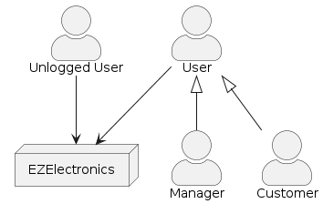
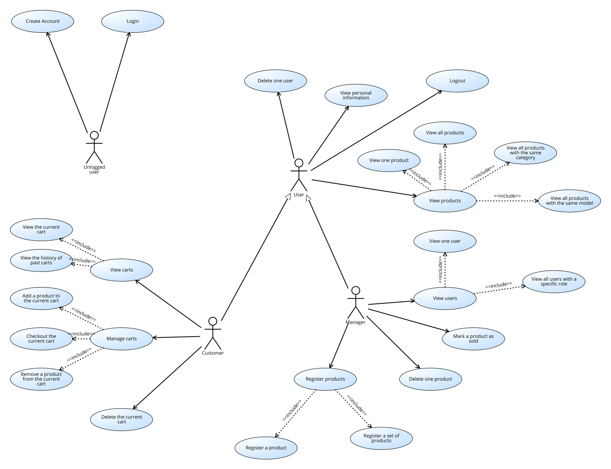
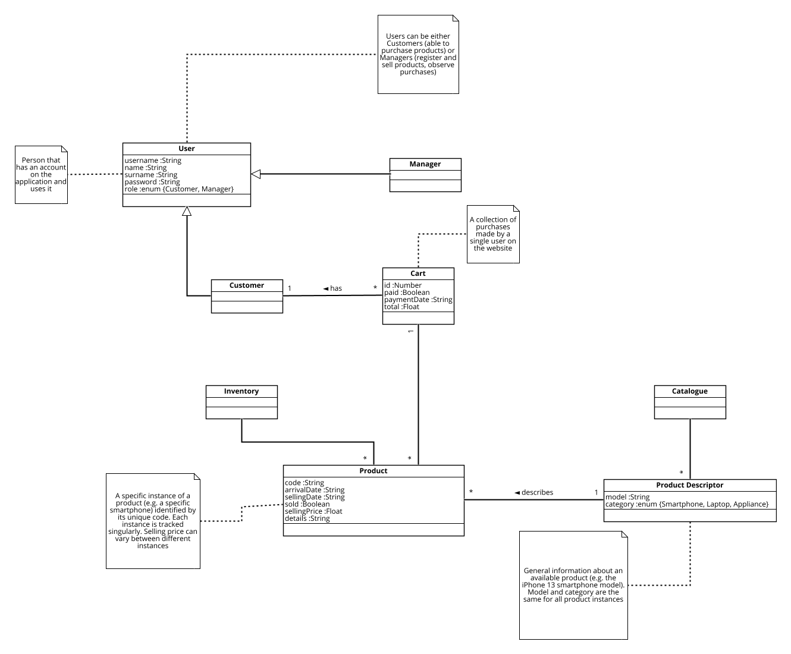
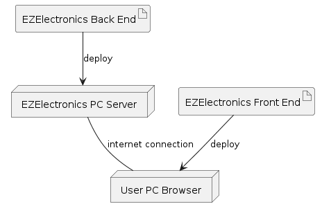

# Requirements Document - current EZElectronics

Date: 10/05/2024

Version: V1 - description of EZElectronics in CURRENT form

# Contents

- [Requirements Document - current EZElectronics](#requirements-document---current-ezelectronics)
- [Contents](#contents)
- [Informal description](#informal-description)
- [Defect table](#defect-table)
- [Stakeholders](#stakeholders)
- [Context Diagram and interfaces](#context-diagram-and-interfaces)
  - [Context Diagram](#context-diagram)
  - [Interfaces](#interfaces)
- [Stories and personas](#stories-and-personas)
- [Functional and non functional requirements](#functional-and-non-functional-requirements)
  - [Functional Requirements](#functional-requirements)
  - [Non Functional Requirements](#non-functional-requirements)
  - [Access Rights](#access-rights)
- [Use case diagram and use cases](#use-case-diagram-and-use-cases)
  - [Use case diagram](#use-case-diagram)
  - [Use Cases](#use-cases)
    - [Use Case 1, Login (UC1)](#use-case-1-login-uc1)
      - [Scenario 1.1](#scenario-11)
      - [Scenario 1.2](#scenario-12)
      - [Scenario 1.3](#scenario-13)
      - [Scenario 1.4](#scenario-14)
    - [Use Case 2, Logout (UC2)](#use-case-2-logout-uc2)
      - [Scenario 2.1](#scenario-21)
      - [Scenario 2.2](#scenario-22)
    - [Use Case 3, Create Account (UC3)](#use-case-3-create-account-uc3)
      - [Scenario 3.1](#scenario-31)
      - [Scenario 3.2](#scenario-32)
      - [Scenario 3.3](#scenario-33)
    - [Use Case 4, View users (UC4)](#use-case-4-view-users-uc4)
      - [Scenario 4.1](#scenario-41)
      - [Scenario 4.2](#scenario-42)
      - [Scenario 4.3](#scenario-43)
      - [Scenario 4.4](#scenario-44)
      - [Scenario 4.5](#scenario-45)
    - [Use Case 5, Delete one user (UC5)](#use-case-5-delete-one-user-uc5)
      - [Scenario 5.1](#scenario-51)
      - [Scenario 5.2](#scenario-52)
    - [Use Case 6, Register products (UC6)](#use-case-6-register-products-uc6)
      - [Scenario 6.1](#scenario-61)
      - [Scenario 6.2](#scenario-62)
      - [Scenario 6.3](#scenario-63)
      - [Scenario 6.4](#scenario-64)
      - [Scenario 6.5](#scenario-65)
    - [Use Case 7, Mark a product as sold (UC7)](#use-case-7-mark-a-product-as-sold-uc7)
      - [Scenario 7.1](#scenario-71)
      - [Scenario 7.2](#scenario-72)
      - [Scenario 7.3](#scenario-73)
    - [Use Case 8, View products (UC8)](#use-case-8-view-products-uc8)
      - [Scenario 8.1](#scenario-81)
      - [Scenario 8.2](#scenario-82)
      - [Scenario 8.3](#scenario-83)
      - [Scenario 8.4](#scenario-84)
      - [Scenario 8.5](#scenario-85)
      - [Scenario 8.6](#scenario-86)
    - [Use Case 9, Delete one product (UC9)](#use-case-9-delete-one-product-uc9)
      - [Scenario 9.1](#scenario-91)
      - [Scenario 9.2](#scenario-92)
    - [Use Case 10, View carts (UC10)](#use-case-10-view-carts-uc10)
      - [Scenario 10.1](#scenario-101)
      - [Scenario 10.2](#scenario-102)
    - [Use Case 11, Manage carts (UC11)](#use-case-11-manage-carts-uc11)
      - [Scenario 11.1](#scenario-111)
      - [Scenario 11.2](#scenario-112)
      - [Scenario 11.3](#scenario-113)
      - [Scenario 11.4](#scenario-114)
      - [Scenario 11.5](#scenario-115)
      - [Scenario 11.6](#scenario-116)
      - [Scenario 11.7](#scenario-117)
      - [Scenario 11.8](#scenario-118)
      - [Scenario 11.9](#scenario-119)
      - [Scenario 11.10](#scenario-1110)
    - [Use Case 12, Delete the current cart (UC12)](#use-case-12-delete-the-current-cart-uc12)
      - [Scenario 12.1](#scenario-121)
      - [Scenario 12.2](#scenario-122)
- [Glossary](#glossary)
- [Deployment Diagram](#deployment-diagram)

# Informal description

EZElectronics (read EaSy Electronics) is a software application designed to help managers of electronics stores to manage their products and offer them to customers through a dedicated website. Managers can assess the available products, record new ones, and confirm purchases. Customers can see available products, add them to a cart and see the history of their past purchases.

# Defect table

The API specification and code implementation differ in some points from what is actually stated in this document.
The table below describes the defects found and how these defects will be fixed in V2.

|                  Defect                  |                                                                                   Description                                                                                    |                                                                                          Fix planned for V2                                                                                          |
| :--------------------------------------: | :------------------------------------------------------------------------------------------------------------------------------------------------------------------------------: | :--------------------------------------------------------------------------------------------------------------------------------------------------------------------------------------------------: |
|       API GET ezelectronics/users        |            Access defect, the document states that no authentication is needed to call the route, meaning that anyone could call it and see information of all users             |                                                  An Admin role will be introduced, only users with Admin privileges will be able to call the route                                                   |
|  API GET ezelectronics/users/role/:role  | Access defect, the document states that no authentication is needed to call the route, meaning that anyone could call it and see information of all users with the specific role |                                                  An Admin role will be introduced, only users with Admin privileges will be able to call the route                                                   |
|  API GET ezelectronics/users/:username   |        Access defect, the document states that no authentication is needed to call the route, meaning that anyone could call it and see information of the requested user        |   The behavior of the route will be changed so that authenticated users will be able to retrieve their personal information, and Admin users will be able to retrieve the information of any user    |
| API DELETE ezelectronics/users/:username |              Access defect, the document states that no authentication is needed to call the route, meaning that anyone could call it and delete the requested user              | The behavior of the route will be changed so that authenticated users will be able to delete their personal information, and Admin users will be able to delete other users, except for other Admins |
|      API DELETE ezelectronics/users      |                  Access defect, the document states that no authentication is needed to call the route, meaning that anyone could call it and delete all users                   |                  The behavior of the route will be changed so that only authorized Admin users will be able to delete all users. Furthermore, the route will not delete Admin users                  |
|    API DELETE ezelectronics/products     |                 Access defect, the document states that no authentication is needed to call the route, meaning that anyone could call it and delete all products                 |                          The behavior of the route will be changed so that only authorized users whose role is either Admin or Manager will be able to delete all products                           |
|      API DELETE ezelectronics/carts      |                  Access defect, the document states that no authentication is needed to call the route, meaning that anyone could call it and delete all carts                   |                            The behavior of the route will be changed so that only authorized users whose role is either Admin or Manager will be able to delete all carts                            |

# Stakeholders

| Stakeholder name |                              Description                              |
| :--------------: | :-------------------------------------------------------------------: |
|     Customer     |        User of the application who buys the available products        |
|     Manager      | User of the application who handles the store by registering products |
|    Developer     |           Person who develops and maintains the application           |

# Context Diagram and interfaces

## Context Diagram

## Interfaces

|     Actor     | Logical Interface | Physical Interface |
| :-----------: | :---------------: | :----------------: |
|   Customer    |        GUI        |         PC         |
|    Manager    |        GUI        |         PC         |
| Unlogged User |        GUI        |         PC         |

# Stories and personas

Persona 1: 
John, 22 years old, is a university student. He wishes to purchase new devices, so he looks on the internet for websites where he can buy a new smartphone/laptop. 
Story:
John browses the EZElectronics catalogue, finds a smartphone that satisfies him, adds it to the cart and buys the smartphone.  
Story:
John's wants to review how much he had spent on devices, so he views the history of his past purchases.

Persona 2:  
Mark, 46 years old, is an electronics store manager. He wants to modernize his shop by offering a website to his customers where he will provide products for online purchases.  
Story:
Mark receives new products in his store, he marks them as available on his website for his online customers.  
Story:
A customer purchases a product directly in Mark's store, so Mark registers the product as sold on the website.  
Story:
Mark wants to keep track of his store's inventory. He views the available products and the products that have been sold.  

# Functional and non functional requirements

## Functional Requirements

|   ID    |                         Name                         |
| :-----: | :--------------------------------------------------: |
| **FR1** |                  **Manage account**                  |
|  FR1.1  |                        Login                         |
|  FR1.2  |                        Logout                        |
|  FR1.3  |                 Create a new account                 |
| **FR2** |                   **Manage users**                   |
|  FR2.1  |              Show the list of all users              |
|  FR2.2  |   Show the list of all users with a specific role    |
|  FR2.3  |        Show the information of a single user         |
|  FR2.4  |                 Delete a single user                 |
| **FR3** |                 **Manage products**                  |
|  FR3.1  |                Register a new product                |
|  FR3.2  |            Register a set of new products            |
|  FR3.3  |                Mark a product as sold                |
|  FR3.4  |            Show the list of all products             |
|  FR3.5  |       Show the information of a single product       |
|  FR3.6  | Show the list of all products with the same category |
|  FR3.7  |  Show the list of all products with the same model   |
|  FR3.8  |               Delete a single product                |
| **FR4** |                   **Manage carts**                   |
|  FR4.1  |       Show the information of the current cart       |
|  FR4.2  |          Add a product to the current cart           |
|  FR4.3  |              Checkout the current cart               |
|  FR4.4  |          Show the history of the paid carts          |
|  FR4.5  |        Remove a product from the current cart        |
|  FR4.6  |               Delete the current cart                |

## Non Functional Requirements

|  ID  | Type (efficiency, reliability, ..) |                                                                            Description                                                                            | Refers to |
| :--: | :--------------------------------: | :---------------------------------------------------------------------------------------------------------------------------------------------------------------: | :-------: |
| NFR1 |             Efficiency             |                                         All functions of the application should have a response time lower than 0.5 sec.                                          |  All FR   |
| NFR2 |             Usability              | At least 95% of average users (no computer professionals with more than 1 year of experience of using PC) can use the application within 1 hour, with no training |  All FR   |

## Access Rights

|  API  |   Unlogged User    |                  Customer                  |            Manager            |
| :---: | :----------------: | :----------------------------------------: | :---------------------------: |
| FR1.1 | :heavy_check_mark: |                    :x:                     |              :x:              |
| FR1.2 |        :x:         |             :heavy_check_mark:             |      :heavy_check_mark:       |
| FR1.3 | :heavy_check_mark: |                    :x:                     |              :x:              |
| FR2.1 |        :x:         |                    :x:                     |      :heavy_check_mark:       |
| FR2.2 |        :x:         |                    :x:                     |      :heavy_check_mark:       |
| FR2.3 |        :x:         | :heavy_check_mark: (their own information) | :heavy_check_mark: (any user) |
| FR2.4 |        :x:         |                    :x:                     |      :heavy_check_mark:       |
| FR3.1 |        :x:         |                    :x:                     |      :heavy_check_mark:       |
| FR3.2 |        :x:         |                    :x:                     |      :heavy_check_mark:       |
| FR3.3 |        :x:         |                    :x:                     |      :heavy_check_mark:       |
| FR3.4 |        :x:         |             :heavy_check_mark:             |      :heavy_check_mark:       |
| FR3.5 |        :x:         |             :heavy_check_mark:             |      :heavy_check_mark:       |
| FR3.6 |        :x:         |             :heavy_check_mark:             |      :heavy_check_mark:       |
| FR3.7 |        :x:         |             :heavy_check_mark:             |      :heavy_check_mark:       |
| FR3.8 |        :x:         |                    :x:                     |      :heavy_check_mark:       |
| FR4.1 |        :x:         |             :heavy_check_mark:             |              :x:              |
| FR4.2 |        :x:         |             :heavy_check_mark:             |              :x:              |
| FR4.3 |        :x:         |             :heavy_check_mark:             |              :x:              |
| FR4.4 |        :x:         |             :heavy_check_mark:             |              :x:              |
| FR4.5 |        :x:         |             :heavy_check_mark:             |              :x:              |
| FR4.6 |        :x:         |             :heavy_check_mark:             |              :x:              |

# Use case diagram and use cases

## Use case diagram

## Use Cases

### Use Case 1, Login (UC1)

| Actors Involved  |          User           |
| :--------------: | :---------------------: |
|   Precondition   | User U is not logged in |
|  Post condition  |     U is logged in      |
| Nominal Scenario |      Scenario 1.1       |
|     Variants     |          None           |
|    Exceptions    | Scenario 1.2, 1.3, 1.4  |

#### Scenario 1.1

|  Scenario 1.1  |                                       Successful Login                                       |
| :------------: | :------------------------------------------------------------------------------------------: |
|  Precondition  |                                       U is registered                                        |
| Post condition |                                        U is logged in                                        |
|     Step#      |                                         Description                                          |
|       1        |                              System: Ask for username, password                              |
|       2        |                              User: Provide username, password.                               |
|       3        |                               System: Read username, password.                               |
|       4        |                            System: Given username, find the user.                            |
|       5        | System: Retrieve password, compare with the one provided. Passwords match, user is auhorized |

#### Scenario 1.2

|  Scenario 1.2  |                                             Wrong password                                              |
| :------------: | :-----------------------------------------------------------------------------------------------------: |
|  Precondition  |                                             U is registered                                             |
| Post condition |                                             U not logged in                                             |
|     Step#      |                                               Description                                               |
|       1        |                                     System: Ask username password.                                      |
|       2        |                                    User: Provide username, password.                                    |
|       3        |                                    System: Read username, password.                                     |
|       4        |                                 System: Given username, find the user.                                  |
|       5        | System: Retrieve password, compare with the one provided. Passwords do not match, user is not auhorized |

#### Scenario 1.3

| Scenario 1.3   |                              User not registered                              |
| -------------- | :---------------------------------------------------------------------------: |
| Precondition   |                              U is not registered                              |
| Post condition |                              User not logged in                               |
| Step#          |                                  Description                                  |
| 1              |                        System: Ask username password.                         |
| 2              |                       User: Provide username, password.                       |
| 3              |   System: Read username, password. Check cookie, the user is not logged in.   |
| 4              | System: Given username, find the user. User is not found. User not authorized |

#### Scenario 1.4

| Scenario 1.4   |                     User already logged in                      |
| -------------- | :-------------------------------------------------------------: |
| Precondition   |                         U is registered                         |
| Post condition |                         U is logged in                          |
| Step#          |                           Description                           |
| 1              |                 System: Ask username password.                  |
| 2              |                User: Provide username, password.                |
| 3              | System: Read username, password. The user is already logged in. |
| 4              |                 System: Return an error message                 |

### Use Case 2, Logout (UC2)

| Actors Involved  |        User        |
| :--------------: | :----------------: |
|   Precondition   |   User U exists    |
|  Post condition  | U is not logged in |
| Nominal Scenario |    Scenario 2.1    |
|     Variants     |                    |
|    Exceptions    |    Scenario 2.2    |

#### Scenario 2.1

| Scenario 2.1   |                   Logout                    |
| -------------- | :-----------------------------------------: |
| Precondition   |               U is logged in                |
| Post condition |               U not logged in               |
| Step#          |                 Description                 |
| 1              |             User: Ask to logout             |
| 2              |      System: Check that U is logged in      |
| 3              |   System: remove user authorization for U   |
| 4              | System: Show a logout confirmation message. |

#### Scenario 2.2

| Scenario 2.2   |                   User already logged out                    |
| -------------- | :----------------------------------------------------------: |
| Precondition   |                      U is not logged in                      |
| Post condition |                      U is not logged in                      |
| Step#          |                         Description                          |
| 1              |                     User: Ask to logout                      |
| 2              |              System: Check that U is logged in               |
| 3              | System: U hasn't performed login yet. Show an error message. |

### Use Case 3, Create Account (UC3)

| Actors Involved  |               User               |
| :--------------: | :------------------------------: |
|   Precondition   | The user doesn't have an account |
|  Post condition  |         User registered          |
| Nominal Scenario |           Scenario 3.1           |
|     Variants     |               None               |
|    Exceptions    |        Scenario 3.2, 3.3         |

#### Scenario 3.1

|  Scenario 3.1  |                                                    Registration                                                    |
| :------------: | :----------------------------------------------------------------------------------------------------------------: |
|  Precondition  |                                          The user doesn't have an account                                          |
| Post condition |                                                  User registered                                                   |
|     Step#      |                                                    Description                                                     |
|       1        |                                               User: Ask to register                                                |
|       2        |                                System: ask username, name, surname, role, password                                 |
|       2        |                               User: Provide username, name, surname, role, password                                |
|       3        |                                System: Read username, name, surname, role, password                                |
|       4        | System: Check that the provided username isn't associated with any account yet. The username hasn't been used yet. |
|       5        |                               System: Create a new user and store their information                                |

#### Scenario 3.2

|  Scenario 3.2  |                                                          Username already in use                                                          |
| :------------: | :---------------------------------------------------------------------------------------------------------------------------------------: |
|  Precondition  |                                                          The user has an account                                                          |
| Post condition |                                                            Registration failed                                                            |
|     Step#      |                                                                Description                                                                |
|       1        |                                                           User: Ask to register                                                           |
|       2        |                                            System: ask username, name, surname, role, password                                            |
|       2        |                                           User: Provide username, name, surname, role, password                                           |
|       3        |                                           System: Read username, name, surname, role, password                                            |
|       4        | System: Check that the provided username isn't associated with any account yet. The username has been used already. Provide error message |

#### Scenario 3.3

|  Scenario 3.3  |                                    User provides empty parameters                                     |
| :------------: | :---------------------------------------------------------------------------------------------------: |
|  Precondition  |                                   The user does not have an account                                   |
| Post condition |                                          Registration failed                                          |
|     Step#      |                                              Description                                              |
|       1        |                                         User: Ask to register                                         |
|       2        |                          System: ask username, name, surname, role, password                          |
|       2        |                         User: Provide username, name, surname, role, password                         |
|       3        |                         System: Read username, name, surname, role, password                          |
|       4        | System: Check that all parameters are filled. At least one parameter is empty. Provide error message. |

### Use Case 4, View users (UC4)

| Actors Involved  |                    User                     |
| :--------------: | :-----------------------------------------: |
|   Precondition   |                    None                     |
|  Post condition  | Information about at least one user is seen |
| Nominal Scenario |                Scenario 4.1                 |
|     Variants     |         Scenario 4.3, Scenario 4.4          |
|    Exceptions    |         Scenario 4.2, Scenario 4.5          |

#### Scenario 4.1

| Scenario 4.1  |    View the information of one user    |
| :-----------: | :------------------------------------: |
| Precondition  |             User U exists              |
| Postcondition |  Information of User U is visualized   |
|     Step#     |              Description               |
|       1       | User: Ask to see information of User U |
|       2       |       System: Ask for U.username       |
|       3       |       User: Provide the username       |
|       4       | System: Retrieve information of User U |
|       5       | System: Display information of User U  |

#### Scenario 4.2

| Scenario 4.2  |   Ask to view information of a user who does not exist   |
| :-----------: | :------------------------------------------------------: |
| Precondition  |                  User U does not exist                   |
| Postcondition |                    An error is shown                     |
|     Step#     |                       Description                        |
|       1       |          User: Ask to see information of User U          |
|       2       |                System: Ask for U.username                |
|       3       |                User: Provide the username                |
|       4       | System: Try to retrieve information of U. U is not found |
|       5       |        System: Notify that User U does not exist         |

#### Scenario 4.3

| Scenario 4.3  |     View the information of all users     |
| :-----------: | :---------------------------------------: |
| Precondition  |                   None                    |
| Postcondition |     Information of all users is shown     |
|     Step#     |                Description                |
|       1       | User: Ask to see information of all users |
|       2       | System: Retrieve information of all users |
|       3       |   System: Show information of all users   |

#### Scenario 4.4

| Scenario 4.4  | View the information of all users with a specific role (Customer or Manager) |
| :-----------: | :--------------------------------------------------------------------------: |
| Precondition  |                    At least one user U with role R exists                    |
| Postcondition |          Information of all users with the requested role is shown           |
|     Step#     |                                 Description                                  |
|       1       |            User: Ask to see information of all users with role R             |
|       2       |                              System: Ask for R                               |
|       3       |                               User: Provide R                                |
|       4       |         System: Retrieve information of all users with user.role = R         |
|       5       |           System: Show information of all users with user.role = R           |

#### Scenario 4.5

| Scenario 4.5  |             Ask to view information of users with a role that does not exist             |
| :-----------: | :--------------------------------------------------------------------------------------: |
| Precondition  |                                           None                                           |
| Postcondition |                                    An error is shown                                     |
|     Step#     |                                       Description                                        |
|       1       |                  User: Ask to see information of all users with role R                   |
|       2       |                                    System: Ask for R                                     |
|       3       |                  User: Provide R. R is neither "Customer" nor "Manager"                  |
|       4       | System: Display an error explaining that only "Customer" and "Manager" are allowed roles |

### Use Case 5, Delete one user (UC5)

| Actors Involved  |              User               |
| :--------------: | :-----------------------------: |
|   Precondition   | At least one user is registered |
|  Postcondition   |  The requested user is deleted  |
| Nominal Scenario |          Scenario 5.1           |
|     Variants     |              None               |
|    Exceptions    |          Scenario 5.2           |

#### Scenario 5.1

| Scenario 5.1  |                 Delete one user                  |
| :-----------: | :----------------------------------------------: |
| Precondition  |                  User U exists                   |
| Postcondition |                User U is deleted                 |
|     Step#     |                   Description                    |
|       1       |            User: Ask to delete User U            |
|       2       |            System: Ask for U.username            |
|       3       |            User: Provide the username            |
|       4       | System: Retrieve information about U. U is found |
|       5       |             System: Delete the user              |

#### Scenario 5.2

| Scenario 5.2  |       Try to delete a user that does not exist       |
| :-----------: | :--------------------------------------------------: |
| Precondition  |                User U does not exist                 |
| Postcondition |                  An error is shown                   |
|     Step#     |                     Description                      |
|       1       |              User: Ask to delete User U              |
|       2       |              System: Ask for U.username              |
|       3       |              User: Provide the username              |
|       4       | System: Retrieve information about U. U is not found |
|       5       |         System: Notify User U does not exist         |

### Use Case 6, Register products (UC6)

| Actors Involved  |           Manager           |
| :--------------: | :-------------------------: |
|   Precondition   |      Manager M exists       |
|  Postcondition   | New products are registered |
| Nominal Scenario |        Scenario 6.1         |
|     Variants     |        Scenario 6.4         |
|    Exceptions    |   Scenario 6.2, 6.3, 6.5    |

#### Scenario 6.1

| Scenario 6.1  |                            Registration of a single product                             |
| :-----------: | :-------------------------------------------------------------------------------------: |
| Precondition  |                                     M is logged in                                      |
| Postcondition |                              A new product P is registered                              |
|     Step#     |                                       Description                                       |
|       1       |                        Manager: Ask to register a new product P                         |
|       2       | System: Ask for P.code, P.model, P.category, P.sellingPrice, P.details, and arrivalDate |
|       3       |                       Manager: Provide the requested information                        |
|       4       |             System: Validate the input parameters. All parameters are valid             |
|       5       |                                System: Create product P                                 |

#### Scenario 6.2

| Scenario 6.2  |                         Try to register a product with an already existing code                         |
| :-----------: | :-----------------------------------------------------------------------------------------------------: |
| Precondition  |                                      M and is logged in, Product P                                      |
| Postcondition |                                            An error is shown                                            |
|     Step#     |                                               Description                                               |
|       1       |                                   Manager: Ask to register Product P2                                   |
|       2       | System: Ask for product P2.code, P2.model, P2.category, P2.sellingPrice, P2.details, and P2.arrivalDate |
|       3       |                      Manager: Provide the requested information, P2.code == P.code                      |
|       4       |                                 System: Validate the input parameters.                                  |
|       5       |                     System: Display an error stating that P2.code is already in use                     |

#### Scenario 6.3

| Scenario 6.3  |                                              Try to register a product with invalid input parameters                                              |
| :-----------: | :-----------------------------------------------------------------------------------------------------------------------------------------------: |
| Precondition  |                                                                  M is logged in                                                                   |
| Postcondition |                                                                 An error is shown                                                                 |
|     Step#     |                                                                    Description                                                                    |
|       1       |                                                        Manager: Ask to register Product P                                                         |
|       2       |                         System: Ask for product P.code, P.model, P.category, P.sellingPrice, P.details, and P.arrivalDate                         |
|       3       |                                                    Manager: Provide the requested information                                                     |
|       4       | System: Validate the input parameters. At least one parameter is invalid (e.g. empty string, category is not "Smartphone", "Laptop", "Appliance") |
|       5       |                                                   System: Display an error explaining the issue                                                   |

#### Scenario 6.4

| Scenario 6.4  |                                     Register a set of new products                                      |
| :-----------: | :-----------------------------------------------------------------------------------------------------: |
| Precondition  |                                             M is logged in                                              |
| Postcondition |                                       New products are registered                                       |
|     Step#     |                                               Description                                               |
|       1       |                             Manager: Ask to register a set of new products                              |
|       2       | System: Ask for model, category, selling price, details, arrival date, and quantity of the new products |
|       3       |                               Manager: Provide the requested information                                |
|       4       |                     System: Validate the input parameters. All parameters are valid                     |
|       5       |                 System: Generate a unique code for each new product (incremental count)                 |
|       6       |                                     System: Create the new products                                     |

#### Scenario 6.5

| Scenario 6.5  |                     Try to register a set of new products with invalid input parameters                     |
| :-----------: | :---------------------------------------------------------------------------------------------------------: |
| Precondition  |                                      Manager M exists and is logged in                                      |
| Postcondition |                                              An error is shown                                              |
|     Step#     |                                                 Description                                                 |
|       1       |                               Manager: Ask to register a set of new products                                |
|       2       |   System: Ask for model, category, selling price, details, arrival date, and quantity of the new products   |
|       3       |                                 Manager: Provide the requested information                                  |
|       4       | System: Validate the input parameters. At least one parameter is invalid (e.g. empty string, quantity is 0) |
|       5       |                                System: Display an error explaining the issue                                |

### Use Case 7, Mark a product as sold (UC7)

| Actors Involved  |          Manager           |
| :--------------: | :------------------------: |
|   Precondition   |      Manager M exists      |
|  Postcondition   |  UP can be marked as sold  |
| Nominal Scenario |        Scenario 7.1        |
|    Variations    |            None            |
|    Exceptions    | Scenario 7.2, Scenario 7.3 |

#### Scenario 7.1

| Scenario 7.1  |                     Mark a product as sold                     |
| :-----------: | :------------------------------------------------------------: |
| Precondition  | Manager M exists and is logged in, an unsold product UP exists |
| Postcondition |                      UP is marked as sold                      |
|     Step#     |                          Description                           |
|       1       |                Manager: Ask to mark UP as sold                 |
|       2       |                    System: Ask for UP.code                     |
|       3       |                   Manager: Provide the code                    |
|       4       |      System: Retrieve information about UP. UP is unsold       |
|       5       |                    System: Mark UP as sold                     |

#### Scenario 7.2

| Scenario 7.2  |               Try to mark as sold a product that does not exist               |
| :-----------: | :---------------------------------------------------------------------------: |
| Precondition  |                       Manager M exists and is logged in                       |
| Postcondition |                               An error is shown                               |
|     Step#     |                                  Description                                  |
|       1       |               Manager: Ask to mark an unsold product UP as sold               |
|       2       |                            System: Ask for UP.code                            |
|       3       |                           Manager: Provide the code                           |
|       4       |           System: Retrieve information about UP. UP does not exist.           |
|       5       | System: Display an error explaining that UP.code does not represent a product |

#### Scenario 7.3

| Scenario 7.3  |     Try to mark as sold a product that has already been sold     |
| :-----------: | :--------------------------------------------------------------: |
| Precondition  |                Manager M exists and is logged in                 |
| Postcondition |                        An error is shown                         |
|     Step#     |                           Description                            |
|       1       |              Manager: Ask to mark product P as sold              |
|       2       |                      System: Ask for P.code                      |
|       3       |                    Manager: Provide the code                     |
|       4       |  System: Retrieve information about P. P has already been sold   |
|       5       | System: Display an error explaining that P has already been sold |

### Use Case 8, View products (UC8)

| Actors Involved  |                      User                      |
| :--------------: | :--------------------------------------------: |
|   Precondition   |                 User U exists                  |
|  Postcondition   | Information about at least one product is seen |
| Nominal Scenario |                  Scenario 8.1                  |
|     Variants     |    Scenario 8.3, Scenario 8.4, Scenario 8.5    |
|    Exceptions    |           Scenario 8.2, Scenario 8.6           |

#### Scenario 8.1

| Scenario 8.1  |      View information of a single product      |
| :-----------: | :--------------------------------------------: |
| Precondition  |     Product P exists, User U is logged in      |
| Postcondition |      Information about product P is seen       |
|     Step#     |                  Description                   |
|       1       |       User: Ask to view information of P       |
|       2       |             System: Ask for P.code             |
|       3       |             User: Provide the code             |
|       4       | System: Retrieve information about P. P exists |
|       5       |      System: Display information about P       |

#### Scenario 8.2

| Scenario 8.2  | Try to view information of a product that does not exist  |
| :-----------: | :-------------------------------------------------------: |
| Precondition  |                    User U is logged in                    |
| Postcondition |                     An error is shown                     |
|     Step#     |                        Description                        |
|       1       |        User: Ask to view information of product P         |
|       2       |                  System: Ask for P.code                   |
|       3       |                  User: Provide the code                   |
|       4       |  System: Retrieve information about P. P does not exist   |
|       5       | System: Display an error explaining that P does not exist |

#### Scenario 8.3

| Scenario 8.3  |         View information of all products         |
| :-----------: | :----------------------------------------------: |
| Precondition  | User U is logged in, at least one Product exists |
| Postcondition |       Information of all products is shown       |
|     Step#     |                   Description                    |
|       1       |   User: Ask to view information of all product   |
|       2       | System: Retrieve the information of all products |
|       3       |  System: Display information about all products  |

#### Scenario 8.4

| Scenario 8.4  |        View information of all products of the same category         |
| :-----------: | :------------------------------------------------------------------: |
| Precondition  |  User U is logged in, at least one Product P with category C exists  |
| Postcondition |         Information of all products with category C is shown         |
|     Step#     |                             Description                              |
|       1       |     User: Ask to view information of all product with category C     |
|       2       |                          System: Ask for C                           |
|       3       |                           User: Provide C                            |
|       4       | System: Retrieve the information of all products with P.category = C |
|       5       |  System: Display information about all products with P.category = C  |

#### Scenario 8.5

| Scenario 8.5  |             Try to view information of all products with a category that does not exist             |
| :-----------: | :-------------------------------------------------------------------------------------------------: |
| Precondition  |                                         User U is logged in                                         |
| Postcondition |                                          An error is shown                                          |
|     Step#     |                                             Description                                             |
|       1       |                    User: Ask to view information of all product with category C                     |
|       2       |                                          System: Ask for C                                          |
|       3       |                                           User: Provide C                                           |
|       4       |             System: Validate C. C is not one of ["Smartphone", "Laptop", "Appliance" ]              |
|       5       | System: Display an error explaining that C can only be one of ["Smartphone", "Laptop", "Appliance"] |

#### Scenario 8.6

| Scenario 8.6  |       View information of all products with the same model        |
| :-----------: | :---------------------------------------------------------------: |
| Precondition  |   User U is logged in, at least one product with model M exists   |
| Postcondition |         Information of all products with model M is shown         |
|     Step#     |                            Description                            |
|       1       |     User: Ask to view information of all product with model M     |
|       2       |                           System: Ask M                           |
|       3       |                          User: Provide M                          |
|       4       | System: Retrieve the information of all products with P.model = M |
|       5       |  System: Display information about all products with P.model = M  |

### Use Case 9, Delete one product (UC9)

| Actors Involved  |     Manager, User      |
| :--------------: | :--------------------: |
|   Precondition   |    Manager M exists    |
|  Postcondition   | One product is deleted |
| Nominal Scenario |      Scenario 9.1      |
|     Variants     |          None          |
|    Exceptions    |      Scenario 9.2      |

#### Scenario 9.1

| Scenario 9.1  |                Delete one product                |
| :-----------: | :----------------------------------------------: |
|  Precondtion  |     Manager M is logged in, Product P exists     |
| Postcondition |                   P is deleted                   |
|     Step#     |                   Description                    |
|       1       |             Manager: Ask to delete P             |
|       2       |              System: Ask for P.code              |
|       3       |            Manager: Provide the code             |
|       4       | System: Retrieve information about P. P is found |
|       5       |                 System: Delete P                 |

#### Scenario 9.2

| Scenario 9.2  |        Try to delete a product that does not exist        |
| :-----------: | :-------------------------------------------------------: |
|  Precondtion  |                  Manager M is logged in                   |
| Postcondition |                     An error is shown                     |
|     Step#     |                        Description                        |
|       1       |             Manager: Ask to delete product P              |
|       2       |                  System: Ask for P.code                   |
|       3       |                 Manager: Provide the code                 |
|       4       |  System: Retrieve information about P. P does not exist   |
|       5       | System: Display an error explaining that P does not exist |

### Use Case 10, View carts (UC10)

| Actors Involved  |         Customer          |
| :--------------: | :-----------------------: |
|   Precondition   |     Customer C exists     |
|  Postcondition   | Cart information is shown |
| Nominal Scenario |       Scenario 10.1       |
|     Variants     |           None            |
|    Exceptions    |           None            |

#### Scenario 10.1

| Scenario 10.1 |   View information of the current cart (not paid yet)   |
| :-----------: | :-----------------------------------------------------: |
| Precondition  | C is logged in, C has a cart that has not been paid yet |
| Postcondition |           Information about the cart is shown           |
|     Step#     |                       Description                       |
|       1       | Customer: Ask to see information about the current cart |
|       2       |   System: Retrieve information about the current cart   |
|       3       |    System: Display the products of the current cart     |

#### Scenario 10.2

| Scenario 10.2 |               View the history of already paid carts               |
| :-----------: | :----------------------------------------------------------------: |
| Precondition  |            C is logged in, C has at least one paid cart            |
| Postcondition |              Information about cart history is shown               |
|     Step#     |                            Description                             |
|       1       |        Customer: Ask to see information about cart history         |
|       2       |                  System: Retrieve past carts of U                  |
|       3       | System: Display cart history (purchase date, total cost, products) |

### Use Case 11, Manage carts (UC11)

| Actors Involved  |                                                 Customer                                                 |
| :--------------: | :------------------------------------------------------------------------------------------------------: |
|   Precondition   |                                            Customer C exists                                             |
|  Postcondition   |                                       C updates their current cart                                       |
| Nominal Scenario |                                              Scenario 11.1                                               |
|     Variants     |                                       Scenario 11.4, Scenario 11.7                                       |
|    Exceptions    | Scenario 11.2, Scenario 11.3, Scenario 11.5, Scenario 11.6, Scenario 11.8, Scenario 11.9, Scenario 11.10 |

#### Scenario 11.1

| Scenario 11.1 |              Add a product to the current cart               |
| :-----------: | :----------------------------------------------------------: |
| Precondition  |     C is logged in, at least one unsold product P exists     |
| Postcondition |                    P is added to the cart                    |
|     Step#     |                         Description                          |
|       1       |         Customer: Ask to add P to their current cart         |
|       2       |                    System: Ask for P.code                    |
|       3       |                  Customer: Provide the code                  |
|       4       | System: Retrieve information about P. P exists and is unsold |
|       5       |              System: Add P to the current cart               |

#### Scenario 11.2

| Scenario 11.2 | Try to add a product that does not exist to the current cart |
| :-----------: | :----------------------------------------------------------: |
| Precondition  |                        C is logged in                        |
| Postcondition |                      An error is shown                       |
|     Step#     |                         Description                          |
|       1       |    Customer: Ask to add a product P to their current cart    |
|       2       |                    System: Ask for P.code                    |
|       3       |                  Customer: Provide the code                  |
|       4       |    System: Retrieve information about P. P does not exist    |
|       5       |  System: Display an error explaining that P does not exist   |

#### Scenario 11.3

| Scenario 11.3 |   Try to add a product that has already been sold to the current cart    |
| :-----------: | :----------------------------------------------------------------------: |
| Precondition  |            C is logged in, at least one sold product P exists            |
| Postcondition |                            An error is shown                             |
|     Step#     |                               Description                                |
|       1       |                Customer: Ask to add P to the current cart                |
|       2       |                          System: Ask for P.code                          |
|       3       |                        Customer: Provide the code                        |
|       4       | System: Retrieve information about P. P exists but has already been sold |
|       5       |                         System: Display an error                         |

#### Scenario 11.4

| Scenario 11.4 |                                        Pay for the current cart                                        |
| :-----------: | :----------------------------------------------------------------------------------------------------: |
| Precondition  |                     C is logged in, C has an unpaid cart with at least one product                     |
| Postcondition |                                     C pays for their current cart                                      |
|     Step#     |                                              Description                                               |
|       1       |                              Customer: Ask to pay for their current cart                               |
|       2       | System: Retrieve information about the current cart. The cart exists and contains at least one product |
|       3       |                                  System: Handle payment for the cart                                   |

#### Scenario 11.5

| Scenario 11.5 |                                  Try to pay for an empty cart                                   |
| :-----------: | :---------------------------------------------------------------------------------------------: |
| Precondition  |                       C is logged in, C has an unpaid cart that is empty                        |
| Postcondition |                                        An error is shown                                        |
|     Step#     |                                           Description                                           |
|       1       |                           Customer: Ask to pay for their current cart                           |
|       2       | System: Retrieve information about the current cart. The cart exists but contains zero products |
|       3       |                   System: Display an error explaining that the cart is empty                    |

#### Scenario 11.6

| Scenario 11.6 |                  Try to pay for a cart that does not exist                   |
| :-----------: | :--------------------------------------------------------------------------: |
| Precondition  |                C is logged in, C does not have an unpaid cart                |
| Postcondition |                              An error is shown                               |
|     Step#     |                                 Description                                  |
|       1       |                 Customer: Ask to pay for their current cart                  |
|       2       | System: Retrieve information about the current cart. The cart does not exist |
|       3       |       System: Display an error explaining that U does not have a cart        |

#### Scenario 11.7

| Scenario 11.7 |              Remove a product from the current cart               |
| :-----------: | :---------------------------------------------------------------: |
| Precondition  | C is logged in, C has an unpaid cart, the cart contains Product P |
| Postcondition |                    P is removed from the cart                     |
|     Step#     |                            Description                            |
|       1       |         Customer: Ask to remove P from their current cart         |
|       2       |                      System: Ask for P.code                       |
|       3       |                    Customer: Provide the code                     |
|       4       |          System: Retrieve information about P. P exists           |
|       5       | System: Retrieve cart information. The cart exists and contains P |
|       6       |                  System: Remove P from the cart                   |

#### Scenario 11.8

| Scenario 11.8 | Try to remove a product that does not exist from the current cart |
| :-----------: | :---------------------------------------------------------------: |
| Precondition  |               C is logged in, C has an unpaid cart                |
| Postcondition |                         An error is shown                         |
|     Step#     |                            Description                            |
|       1       |    Customer: Ask to remove a Product P from their current cart    |
|       2       |                      System: Ask for P.code                       |
|       3       |                    Customer: Provide the code                     |
|       4       |      System: Retrieve information about P. P does not exist       |
|       5       |     System: Display an error explaining that P does not exist     |

#### Scenario 11.9

| Scenario 11.9 |      Try to remove a product from a cart that does not exist      |
| :-----------: | :---------------------------------------------------------------: |
| Precondition  | C is logged in, C does not have an unpaid cart, Product P exists  |
| Postcondition |                         An error is shown                         |
|     Step#     |                            Description                            |
|       1       |    Customer: Ask to remove a Product P from their current cart    |
|       2       |                      System: Ask for P.code                       |
|       3       |                    Customer: Provide the code                     |
|       4       |          System: Retrieve information about P. P exists           |
|       5       | System: Retrieve cart information. C does not have an unpaid cart |
|       6       |  System: Display an error explaining that C does not have a cart  |

#### Scenario 11.10

| Scenario 11.10 |               Try to remove a product that is not in the current cart               |
| :------------: | :---------------------------------------------------------------------------------: |
|  Precondition  | C is logged in, C has an unpaid cart, Product P exists, P is not in the unpaid cart |
| Postcondition  |                                  An error is shown                                  |
|     Step#      |                                     Description                                     |
|       1        |                   Customer: Ask to remove P from the current cart                   |
|       2        |                               System: Ask for P.code                                |
|       3        |                             Customer: Provide the code                              |
|       4        |                   System: Retrieve information about P. P exists                    |
|       5        |      System: Retrieve cart information. The cart exists but does not contain P      |
|       6        |        System: Display an error explaining that the cart does not contain P         |

### Use Case 12, Delete the current cart (UC12)

| Actors Involved  |      Customer, User      |
| :--------------: | :----------------------: |
|   Precondition   | At least one cart exists |
|  Postcondition   |    A cart is deleted     |
| Nominal Scenario |      Scenario 12.1       |
|     Variants     |      Scenario 12.3       |
|    Exceptions    |      Scenario 12.2       |

#### Scenario 12.1

| Scenario 12.1 |                 Delete the current cart                  |
| :-----------: | :------------------------------------------------------: |
| Precondition  | Customer C exists and is logged in, C has an unpaid cart |
| Postcondition |               The current cart is deleted                |
|     Step#     |                       Description                        |
|       1       |        Customer: Ask to delete their current cart        |
|       2       |    System: Retrieve cart information. The cart exist     |
|       3       |             System: Delete the current cart              |

#### Scenario 12.2

| Scenario 12.2 |         Try to delete the current cart when there is none          |
| :-----------: | :----------------------------------------------------------------: |
| Precondition  | Customer C exists and is logged in, C does not have an unpaid cart |
| Postcondition |                         An error is shown                          |
|     Step#     |                            Description                             |
|       1       |              Customer: Ask to delete the current cart              |
|       2       |        System: Retrieve cart information. There is no cart         |
|       3       |                      System: Display an error                      |

# Glossary

Inventory, catalogue, and product descriptor classes are not included in the code, as the combination of the available classes is enough to implement the functional requirements.

# Deployment Diagram

