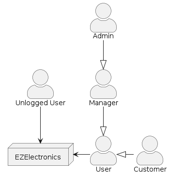
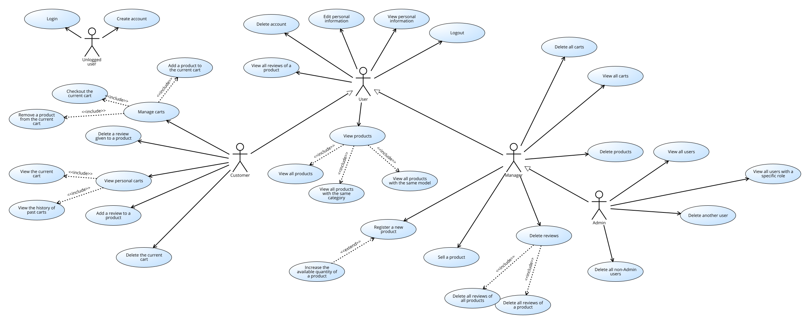
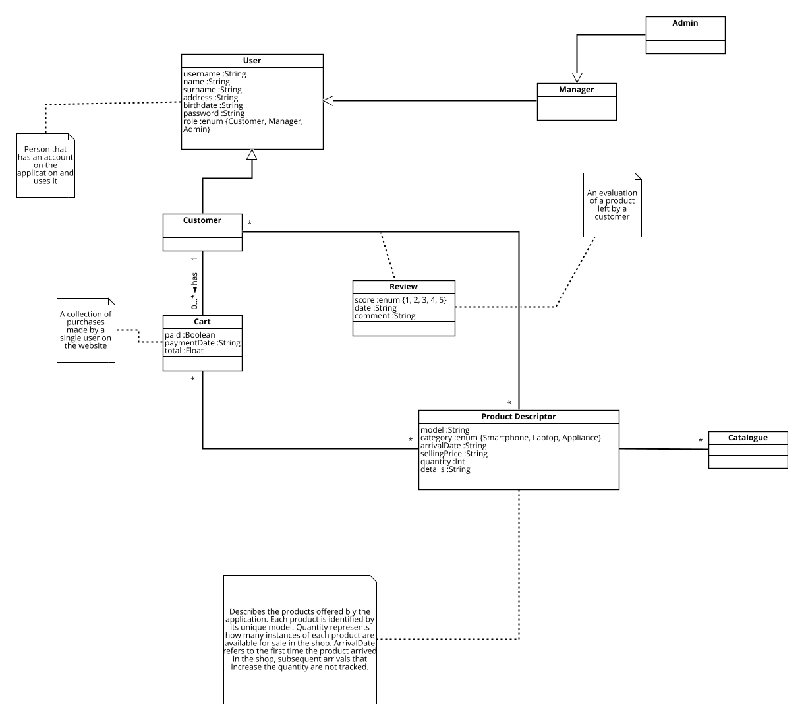

# Requirements Document - future EZElectronics

Date: 10/05/2024

Version: V2 - description of EZElectronics in FUTURE form

# Contents

- [Requirements Document - future EZElectronics](#requirements-document---future-ezelectronics)
- [Contents](#contents)
- [Informal description](#informal-description)
- [Stakeholders](#stakeholders)
- [Context Diagram and interfaces](#context-diagram-and-interfaces)
  - [Context Diagram](#context-diagram)
  - [Interfaces](#interfaces)
- [Functional and non functional requirements](#functional-and-non-functional-requirements)
  - [Functional Requirements](#functional-requirements)
  - [Access Rights](#access-rights)
  - [Non Functional Requirements](#non-functional-requirements)
- [Use case diagram and use cases](#use-case-diagram-and-use-cases)
  - [Use case diagram](#use-case-diagram)
  - [Use Cases](#use-cases)
    - [Use Case 1, Login (UC1)](#use-case-1-login-uc1)
      - [Scenario 1.1](#scenario-11)
      - [Scenario 1.2](#scenario-12)
      - [Scenario 1.3](#scenario-13)
      - [Scenario 1.4](#scenario-14)
    - [Use Case 2, Logout (UC2)](#use-case-2-logout-uc2)
      - [Scenario 2.1](#scenario-21)
      - [Scenario 2.2](#scenario-22)
    - [Use Case 3, Create Account (UC3)](#use-case-3-create-account-uc3)
      - [Scenario 3.1](#scenario-31)
      - [Scenario 3.2](#scenario-32)
      - [Scenario 3.3](#scenario-33)
    - [Use Case 4, View users (UC4)](#use-case-4-view-users-uc4)
      - [Scenario 4.1](#scenario-41)
      - [Scenario 4.2](#scenario-42)
      - [Scenario 4.3](#scenario-43)
      - [Scenario 4.4](#scenario-44)
      - [Scenario 4.5](#scenario-45)
    - [Use Case 5, Delete one user (UC5)](#use-case-5-delete-one-user-uc5)
      - [Scenario 5.1](#scenario-51)
      - [Scenario 5.2](#scenario-52)
    - [Use Case 6, Register products (UC6)](#use-case-6-register-products-uc6)
      - [Scenario 6.1](#scenario-61)
      - [Scenario 6.2](#scenario-62)
      - [Scenario 6.3](#scenario-63)
      - [Scenario 6.4](#scenario-64)
      - [Scenario 6.5](#scenario-65)
    - [Use Case 7, Sell a product (UC7)](#use-case-7-sell-a-product-uc7)
      - [Scenario 7.1](#scenario-71)
      - [Scenario 7.2](#scenario-72)
      - [Scenario 7.3](#scenario-73)
    - [Use Case 8, View products (UC8)](#use-case-8-view-products-uc8)
      - [Scenario 8.1](#scenario-81)
      - [Scenario 8.2](#scenario-82)
      - [Scenario 8.3](#scenario-83)
      - [Scenario 8.4](#scenario-84)
      - [Scenario 8.5](#scenario-85)
      - [Scenario 8.6](#scenario-86)
      - [Scenario 8.7](#scenario-87)
      - [Scenario 8.8](#scenario-88)
      - [Scenario 8.9](#scenario-89)
    - [Use Case 9, Delete one product (UC9)](#use-case-9-delete-one-product-uc9)
      - [Scenario 9.1](#scenario-91)
      - [Scenario 9.2](#scenario-92)
    - [Use Case 10, Manage carts (UC11)](#use-case-10-manage-carts-uc11)
      - [Scenario 10.1](#scenario-101)
      - [Scenario 10.2](#scenario-102)
      - [Scenario 10.3](#scenario-103)
      - [Scenario 10.4](#scenario-104)
      - [Scenario 10.5](#scenario-105)
      - [Scenario 10.6](#scenario-106)
      - [Scenario 10.7](#scenario-107)
      - [Scenario 10.8](#scenario-108)
      - [Scenario 10.9](#scenario-109)
      - [Scenario 10.10](#scenario-1010)
      - [Scenario 10.11](#scenario-1011)
      - [Scenario 10.12](#scenario-1012)
    - [Use Case 11, Delete the current cart (UC11)](#use-case-11-delete-the-current-cart-uc11)
      - [Scenario 11.1](#scenario-111)
      - [Scenario 11.2](#scenario-112)
    - [Use Case 12, Edit user information](#use-case-12-edit-user-information)
      - [Scenario 12.1](#scenario-121)
    - [Use Case 13, Delete all non-Admin users (UC13)](#use-case-13-delete-all-non-admin-users-uc13)
      - [Scenario 13.1](#scenario-131)
    - [Use Case 14, Delete all products (UC14)](#use-case-14-delete-all-products-uc14)
      - [Scenario 14.1](#scenario-141)
    - [Use Case 15, View all carts (UC15)](#use-case-15-view-all-carts-uc15)
      - [Scenario 15.1](#scenario-151)
      - [Use Case 16, Delete all carts (UC16)](#use-case-16-delete-all-carts-uc16)
      - [Scenario 16.1](#scenario-161)
    - [Use Case 17, Manage reviews (UC12)](#use-case-17-manage-reviews-uc12)
      - [Scenario 17.1](#scenario-171)
      - [Scenario 17.2](#scenario-172)
    - [Use Case 18, View reviews (UC13)](#use-case-18-view-reviews-uc13)
      - [Scenario 18.1](#scenario-181)
    - [Use Case 19, Delete reviews (UC19)](#use-case-19-delete-reviews-uc19)
      - [Scenario 19.1](#scenario-191)
      - [Scenario 19.2](#scenario-192)
- [Glossary](#glossary)
- [Deployment Diagram](#deployment-diagram)

# Informal description

EZElectronics (read EaSy Electronics) is a software application designed to help managers of electronics stores to manage their products and offer them to customers through a dedicated website. Managers can assess the available products, record new ones, and confirm purchases. Customers can see available products, add them to a cart to buy them, see the history of their past purchases, leave reviews of the products they have purchased, and see the reviews of the available products. Admins can assess the status of the system and manage data through delete operations.

# Stakeholders

| Stakeholder name |                                          Description                                          |
| :--------------: | :-------------------------------------------------------------------------------------------: |
|     Customer     |                    User of the application who buys the available products                    |
|     Manager      |             User of the application who handles the store by registering products             |
|      Admin       | User of the application who handles the system and checks that everything runs without issues |
|    Developer     |                       Person who develops and maintains the application                       |

# Context Diagram and interfaces

## Context Diagram

## Interfaces

|     Actor     | Logical Interface | Physical Interface |
| :-----------: | :---------------: | :----------------: |
|   Customer    |        GUI        |         PC         |
|    Manager    |        GUI        |         PC         |
|     Admin     |        GUI        |         PC         |
| Unlogged User |        GUI        |         PC         |

# Functional and non functional requirements

## Functional Requirements

|   ID    |                              Name                              |
| :-----: | :------------------------------------------------------------: |
| **FR1** |                       **Manage account**                       |
|  FR1.1  |                             Login                              |
|  FR1.2  |                             Logout                             |
|  FR1.3  |                   Create a new user account                    |
| **FR2** |                        **Manage users**                        |
|  FR2.1  |                   Show the list of all users                   |
|  FR2.2  |        Show the list of all users with a specific role         |
|  FR2.3  |             Show the information of a single user              |
|  FR2.4  |            Update the information of a single user             |
|  FR2.5  |                Delete a single _non Admin_ user                |
|  FR2.6  |                  Delete all _non Admin_ users                  |
| **FR3** |                      **Manage products**                       |
|  FR3.1  |                 Register a set of new products                 |
|  FR3.2  |                Update the quantity of a product                |
|  FR3.3  |                         Sell a product                         |
|  FR3.4  |                 Show the list of all products                  |
| FR3.4.1 |            Show the list of all available products             |
|  FR3.5  |      Show the list of all products with the same category      |
| FR3.5.1 | Show the list of all available products with the same category |
|  FR3.5  |       Show the list of all products with the same model        |
| FR3.5.1 |  Show the list of all available products with the same model   |
|  FR3.7  |                        Delete a product                        |
|  FR3.8  |                      Delete all products                       |
| **FR4** |                       **Manage reviews**                       |
|  FR4.1  |                 Add a new review to a product                  |
|  FR4.2  |       Get the list of all reviews assigned to a product        |
|  FR4.3  |               Delete a review given to a product               |
|  FR4.4  |                Delete all reviews of a product                 |
|  FR4.5  |               Delete all reviews of all products               |
| **FR5** |                        **Manage carts**                        |
|  FR5.1  |            Show the information of the current cart            |
|  FR5.2  |               Add a product to the current cart                |
|  FR5.3  |                   Checkout the current cart                    |
|  FR5.4  |               Show the history of the paid carts               |
|  FR5.5  |             Remove a product from the current cart             |
|  FR5.6  |                    Delete the current cart                     |
|  FR5.7  |             See the list of all carts of all users             |
|  FR5.8  |                        Delete all carts                        |

## Access Rights

|   FR    |      Unlogged      |             Customer              |              Manager              |             Admin             |
| :-----: | :----------------: | :-------------------------------: | :-------------------------------: | :---------------------------: |
|  FR1.1  | :heavy_check_mark: |                :x:                |                :x:                |              :x:              |
|  FR1.2  |        :x:         |        :heavy_check_mark:         |        :heavy_check_mark:         |      :heavy_check_mark:       |
|  FR1.3  | :heavy_check_mark: |                :x:                |                :x:                |              :x:              |
|  FR2.1  |        :x:         |                :x:                |                :x:                |      :heavy_check_mark:       |
|  FR2.2  |        :x:         |                :x:                |                :x:                |      :heavy_check_mark:       |
|  FR2.3  |        :x:         | :heavy_check_mark: (its own user) | :heavy_check_mark: (its own user) | :heavy_check_mark: (any user) |
|  FR2.4  |        :x:         | :heavy_check_mark: (its own user) | :heavy_check_mark: (its own user) | :heavy_check_mark: (any user) |
|  FR2.5  |        :x:         | :heavy_check_mark: (its own user) | :heavy_check_mark: (its own user) | :heavy_check_mark: (any user) |
|  FR2.6  |        :x:         |                :x:                |                :x:                |      :heavy_check_mark:       |
|  FR3.1  |        :x:         |                :x:                |        :heavy_check_mark:         |      :heavy_check_mark:       |
|  FR3.2  |        :x:         |                :x:                |        :heavy_check_mark:         |      :heavy_check_mark:       |
|  FR3.3  |        :x:         |                :x:                |        :heavy_check_mark:         |      :heavy_check_mark:       |
|  FR3.4  |        :x:         |                :x:                |        :heavy_check_mark:         |      :heavy_check_mark:       |
| FR3.4.1 |        :x:         |        :heavy_check_mark:         |        :heavy_check_mark:         |      :heavy_check_mark:       |
|  FR3.5  |        :x:         |                :x:                |        :heavy_check_mark:         |      :heavy_check_mark:       |
| FR3.5.1 |        :x:         |        :heavy_check_mark:         |        :heavy_check_mark:         |      :heavy_check_mark:       |
|  FR3.6  |        :x:         |                :x:                |        :heavy_check_mark:         |      :heavy_check_mark:       |
| FR3.6.1 |        :x:         |        :heavy_check_mark:         |        :heavy_check_mark:         |      :heavy_check_mark:       |
|  FR3.7  |        :x:         |                :x:                |        :heavy_check_mark:         |      :heavy_check_mark:       |
|  FR3.8  |        :x:         |                :x:                |        :heavy_check_mark:         |      :heavy_check_mark:       |
|  FR4.1  |        :x:         |        :heavy_check_mark:         |                :x:                |              :x:              |
|  FR4.2  |        :x:         |        :heavy_check_mark:         |        :heavy_check_mark:         |      :heavy_check_mark:       |
|  FR4.3  |        :x:         | :heavy_check_mark: (their review) |                :x:                |              :x:              |
|  FR4.4  |        :x:         |                :x:                |        :heavy_check_mark:         |      :heavy_check_mark:       |
|  FR4.5  |        :x:         |                :x:                |        :heavy_check_mark:         |      :heavy_check_mark:       |
|  FR5.1  |        :x:         |        :heavy_check_mark:         |                :x:                |              :x:              |
|  FR5.2  |        :x:         |        :heavy_check_mark:         |                :x:                |              :x:              |
|  FR5.3  |        :x:         |        :heavy_check_mark:         |                :x:                |              :x:              |
|  FR5.4  |        :x:         |        :heavy_check_mark:         |                :x:                |              :x:              |
|  FR5.5  |        :x:         |        :heavy_check_mark:         |                :x:                |              :x:              |
|  FR5.6  |        :x:         |        :heavy_check_mark:         |                :x:                |              :x:              |
|  FR5.7  |        :x:         |                :x:                |        :heavy_check_mark:         |      :heavy_check_mark:       |
|  FR5.8  |        :x:         |                :x:                |        :heavy_check_mark:         |      :heavy_check_mark:       |

## Non Functional Requirements

| ID   | Type (efficiency, reliability, ..) | Description                                                                                                                                                       |           Refers to |
| ---- | :--------------------------------: | :---------------------------------------------------------------------------------------------------------------------------------------------------------------- | ------------------: |
| NFR1 |             Efficiency             | The application should have a response time lower than 0.5 sec.                                                                                                   | FR1,FR2,FR3,FR4,FR5 |
| NFR2 |             Usability              | At least 95% of average users (no computer professionals with more than 1 year of experience of using PC) can use the application within 1 hour, with no training | FR1,FR2,FR3,FR4,FR5 |

# Use case diagram and use cases

## Use case diagram

## Use Cases

### Use Case 1, Login (UC1)

| Actors Involved  |          User           |
| :--------------: | :---------------------: |
|   Precondition   | User U is not logged in |
|  Post condition  |     U is logged in      |
| Nominal Scenario |      Scenario 1.1       |
|     Variants     |          None           |
|    Exceptions    | Scenario 1.2, 1.3, 1.4  |

#### Scenario 1.1

|  Scenario 1.1  |                                       Successful Login                                       |
| :------------: | :------------------------------------------------------------------------------------------: |
|  Precondition  |                                       U is registered                                        |
| Post condition |                                        U is logged in                                        |
|     Step#      |                                         Description                                          |
|       1        |                              System: Ask for username, password                              |
|       2        |                              User: Provide username, password.                               |
|       3        |                               System: Read username, password.                               |
|       4        |                            System: Given username, find the user.                            |
|       5        | System: Retrieve password, compare with the one provided. Passwords match, user is auhorized |

#### Scenario 1.2

|  Scenario 1.2  |                                             Wrong password                                              |
| :------------: | :-----------------------------------------------------------------------------------------------------: |
|  Precondition  |                                             U is registered                                             |
| Post condition |                                             U not logged in                                             |
|     Step#      |                                               Description                                               |
|       1        |                                     System: Ask username password.                                      |
|       2        |                                    User: Provide username, password.                                    |
|       3        |                                    System: Read username, password.                                     |
|       4        |                                 System: Given username, find the user.                                  |
|       5        | System: Retrieve password, compare with the one provided. Passwords do not match, user is not auhorized |

#### Scenario 1.3

| Scenario 1.3   |                              User not registered                              |
| -------------- | :---------------------------------------------------------------------------: |
| Precondition   |                              U is not registered                              |
| Post condition |                              User not logged in                               |
| Step#          |                                  Description                                  |
| 1              |                        System: Ask username password.                         |
| 2              |                       User: Provide username, password.                       |
| 3              |   System: Read username, password. Check cookie, the user is not logged in.   |
| 4              | System: Given username, find the user. User is not found. User not authorized |

#### Scenario 1.4

| Scenario 1.4   |                     User already logged in                      |
| -------------- | :-------------------------------------------------------------: |
| Precondition   |                         U is registered                         |
| Post condition |                         U is logged in                          |
| Step#          |                           Description                           |
| 1              |                 System: Ask username password.                  |
| 2              |                User: Provide username, password.                |
| 3              | System: Read username, password. The user is already logged in. |
| 4              |                 System: Return an error message                 |

### Use Case 2, Logout (UC2)

| Actors Involved  |        User        |
| :--------------: | :----------------: |
|   Precondition   |   User U exists    |
|  Post condition  | U is not logged in |
| Nominal Scenario |    Scenario 2.1    |
|     Variants     |                    |
|    Exceptions    |    Scenario 2.2    |

#### Scenario 2.1

| Scenario 2.1   |                   Logout                    |
| -------------- | :-----------------------------------------: |
| Precondition   |               U is logged in                |
| Post condition |               U not logged in               |
| Step#          |                 Description                 |
| 1              |             User: Ask to logout             |
| 2              |      System: Check that U is logged in      |
| 3              |   System: remove user authorization for U   |
| 4              | System: Show a logout confirmation message. |

#### Scenario 2.2

| Scenario 2.2   |                   User already logged out                    |
| -------------- | :----------------------------------------------------------: |
| Precondition   |                      U is not logged in                      |
| Post condition |                      U is not logged in                      |
| Step#          |                         Description                          |
| 1              |                     User: Ask to logout                      |
| 2              |              System: Check that U is logged in               |
| 3              | System: U hasn't performed login yet. Show an error message. |

### Use Case 3, Create Account (UC3)

| Actors Involved  |               User               |
| :--------------: | :------------------------------: |
|   Precondition   | The user doesn't have an account |
|  Post condition  |         User registered          |
| Nominal Scenario |           Scenario 3.1           |
|     Variants     |               None               |
|    Exceptions    |        Scenario 3.2, 3.3         |

#### Scenario 3.1

|  Scenario 3.1  |                                                    Registration                                                    |
| :------------: | :----------------------------------------------------------------------------------------------------------------: |
|  Precondition  |                                          The user doesn't have an account                                          |
| Post condition |                                                  User registered                                                   |
|     Step#      |                                                    Description                                                     |
|       1        |                                               User: Ask to register                                                |
|       2        |                                System: ask username, name, surname, role, password                                 |
|       2        |                               User: Provide username, name, surname, role, password                                |
|       3        |                                System: Read username, name, surname, role, password                                |
|       4        | System: Check that the provided username isn't associated with any account yet. The username hasn't been used yet. |
|       5        |                               System: Create a new user and store their information                                |

#### Scenario 3.2

|  Scenario 3.2  |                                                          Username already in use                                                          |
| :------------: | :---------------------------------------------------------------------------------------------------------------------------------------: |
|  Precondition  |                                                          The user has an account                                                          |
| Post condition |                                                            Registration failed                                                            |
|     Step#      |                                                                Description                                                                |
|       1        |                                                           User: Ask to register                                                           |
|       2        |                                            System: ask username, name, surname, role, password                                            |
|       2        |                                           User: Provide username, name, surname, role, password                                           |
|       3        |                                           System: Read username, name, surname, role, password                                            |
|       4        | System: Check that the provided username isn't associated with any account yet. The username has been used already. Provide error message |

#### Scenario 3.3

|  Scenario 3.3  |                                    User provides empty parameters                                     |
| :------------: | :---------------------------------------------------------------------------------------------------: |
|  Precondition  |                                   The user does not have an account                                   |
| Post condition |                                          Registration failed                                          |
|     Step#      |                                              Description                                              |
|       1        |                                         User: Ask to register                                         |
|       2        |                          System: ask username, name, surname, role, password                          |
|       2        |                         User: Provide username, name, surname, role, password                         |
|       3        |                         System: Read username, name, surname, role, password                          |
|       4        | System: Check that all parameters are filled. At least one parameter is empty. Provide error message. |

### Use Case 4, View users (UC4)

| Actors Involved  |                    User                     |
| :--------------: | :-----------------------------------------: |
|   Precondition   |                    None                     |
|  Post condition  | Information about at least one user is seen |
| Nominal Scenario |                Scenario 4.1                 |
|     Variants     |         Scenario 4.3, Scenario 4.4          |
|    Exceptions    |         Scenario 4.2, Scenario 4.5          |

#### Scenario 4.1

| Scenario 4.1  |    View the information of one user    |
| :-----------: | :------------------------------------: |
| Precondition  |             User U exists              |
| Postcondition |  Information of User U is visualized   |
|     Step#     |              Description               |
|       1       | User: Ask to see information of User U |
|       2       |       System: Ask for U.username       |
|       3       |       User: Provide the username       |
|       4       | System: Retrieve information of User U |
|       5       | System: Display information of User U  |

#### Scenario 4.2

| Scenario 4.2  |   Ask to view information of a user who does not exist   |
| :-----------: | :------------------------------------------------------: |
| Precondition  |                  User U does not exist                   |
| Postcondition |                    An error is shown                     |
|     Step#     |                       Description                        |
|       1       |          User: Ask to see information of User U          |
|       2       |                System: Ask for U.username                |
|       3       |                User: Provide the username                |
|       4       | System: Try to retrieve information of U. U is not found |
|       5       |        System: Notify that User U does not exist         |

#### Scenario 4.3

| Scenario 4.3  |     View the information of all users     |
| :-----------: | :---------------------------------------: |
| Precondition  |                   None                    |
| Postcondition |     Information of all users is shown     |
|     Step#     |                Description                |
|       1       | User: Ask to see information of all users |
|       2       | System: Retrieve information of all users |
|       3       |   System: Show information of all users   |

#### Scenario 4.4

| Scenario 4.4  | View the information of all users with a specific role (Customer or Manager) |
| :-----------: | :--------------------------------------------------------------------------: |
| Precondition  |                    At least one user U with role R exists                    |
| Postcondition |          Information of all users with the requested role is shown           |
|     Step#     |                                 Description                                  |
|       1       |            User: Ask to see information of all users with role R             |
|       2       |                              System: Ask for R                               |
|       3       |                               User: Provide R                                |
|       4       |         System: Retrieve information of all users with user.role = R         |
|       5       |           System: Show information of all users with user.role = R           |

#### Scenario 4.5

| Scenario 4.5  |             Ask to view information of users with a role that does not exist             |
| :-----------: | :--------------------------------------------------------------------------------------: |
| Precondition  |                                           None                                           |
| Postcondition |                                    An error is shown                                     |
|     Step#     |                                       Description                                        |
|       1       |                  User: Ask to see information of all users with role R                   |
|       2       |                                    System: Ask for R                                     |
|       3       |                  User: Provide R. R is neither "Customer" nor "Manager"                  |
|       4       | System: Display an error explaining that only "Customer" and "Manager" are allowed roles |

### Use Case 5, Delete one user (UC5)

| Actors Involved  |              User               |
| :--------------: | :-----------------------------: |
|   Precondition   | At least one user is registered |
|  Postcondition   |  The requested user is deleted  |
| Nominal Scenario |          Scenario 5.1           |
|     Variants     |              None               |
|    Exceptions    |          Scenario 5.2           |

#### Scenario 5.1

| Scenario 5.1  |                 Delete one user                  |
| :-----------: | :----------------------------------------------: |
| Precondition  |                  User U exists                   |
| Postcondition |                User U is deleted                 |
|     Step#     |                   Description                    |
|       1       |            User: Ask to delete User U            |
|       2       |            System: Ask for U.username            |
|       3       |            User: Provide the username            |
|       4       | System: Retrieve information about U. U is found |
|       5       |             System: Delete the user              |

#### Scenario 5.2

| Scenario 5.2  |       Try to delete a user that does not exist       |
| :-----------: | :--------------------------------------------------: |
| Precondition  |                User U does not exist                 |
| Postcondition |                  An error is shown                   |
|     Step#     |                     Description                      |
|       1       |              User: Ask to delete User U              |
|       2       |              System: Ask for U.username              |
|       3       |              User: Provide the username              |
|       4       | System: Retrieve information about U. U is not found |
|       5       |         System: Notify User U does not exist         |

### Use Case 6, Register products (UC6)

| Actors Involved  |           Manager           |
| :--------------: | :-------------------------: |
|   Precondition   |      Manager M exists       |
|  Postcondition   | New products are registered |
| Nominal Scenario |        Scenario 6.1         |
|     Variants     |        Scenario 6.4         |
|    Exceptions    |   Scenario 6.2, 6.3, 6.5    |

#### Scenario 6.1

| Scenario 6.1  |                                   Register a new product                                   |
| :-----------: | :----------------------------------------------------------------------------------------: |
| Precondition  |                           M is logged in, P.model does not exist                           |
| Postcondition |                                      P.model recorded                                      |
|     Step#     |                                        Description                                         |
|       1       |                          Manager: Ask to register a new product P                          |
|       2       | System: Ask forP.model, P.category, P.sellingPrice, P.details, P.quantity, and arrivalDate |
|       3       |                         Manager: Provide the requested information                         |
|       4       |              System: Validate the input parameters. All parameters are valid               |
|       5       |           System: Create product P. The available quantity is set to P.quantity            |

#### Scenario 6.2

| Scenario 6.2  |                              Try to register a product that already exists                               |
| :-----------: | :------------------------------------------------------------------------------------------------------: |
| Precondition  |                                      M is logged in, P.model exists                                      |
| Postcondition |                                            An error is shown                                             |
|     Step#     |                                               Description                                                |
|       1       |                                   Manager: Ask to register Product P2                                    |
|       2       | System: Ask for product P2.model, P2.category, P2.sellingPrice, P2.details, P2.model, and P2.arrivalDate |
|       3       |                     Manager: Provide the requested information, P2.model == P.model                      |
|       4       |                                  System: Validate the input parameters.                                  |
|       5       |                     System: Display an error stating that P2.model is already in use                     |

#### Scenario 6.3

| Scenario 6.3  |                                                     Try to register a product with invalid input parameters                                                     |
| :-----------: | :-------------------------------------------------------------------------------------------------------------------------------------------------------------: |
| Precondition  |                                                                         M is logged in                                                                          |
| Postcondition |                                                                        An error is shown                                                                        |
|     Step#     |                                                                           Description                                                                           |
|       1       |                                                               Manager: Ask to register Product P                                                                |
|       2       |                              System: Ask for product P.model, P.category, P.sellingPrice, P.details, P.quantity, and P.arrivalDate                              |
|       3       |                                                           Manager: Provide the requested information                                                            |
|       4       | System: Validate the input parameters. At least one parameter is invalid (e.g. empty string, category is not "Smartphone", "Laptop", "Appliance", quantity = 0) |
|       5       |                                                          System: Display an error explaining the issue                                                          |

#### Scenario 6.4

| Scenario 6.4  |                                           Update the quantity of a product                                            |
| :-----------: | :-------------------------------------------------------------------------------------------------------------------: |
| Precondition  |                                        M is logged in, P.model exists, n >= 0                                         |
| Postcondition |                                        P.quantity (post)= P.quantity (pre) + n                                        |
|     Step#     |                                                      Description                                                      |
|       1       |                                      Manager: Ask to increase the quantity of P                                       |
|       2       |                      System: Ask for P.model, the increase in quantity and the date of increase                       |
|       3       |                                      Manager: Provide the requested information                                       |
|       4       | System: Validate input parameters. P exists, the quantity is a valid number, the date is valid. Increase P's quantity |
|       5       |                             System: Display a message confirming the increase in quantity                             |

#### Scenario 6.5

| Scenario 6.5  |        Try to increase the quantity of a product that does not exist        |
| :-----------: | :-------------------------------------------------------------------------: |
| Precondition  |          Manager M exists and is logged in, P.model does not exist          |
| Postcondition |                              An error is shown                              |
|     Step#     |                                 Description                                 |
|       1       |             Manager: Ask to increase the quantity of product P              |
|       2       | System: Ask for P.model, the increase in quantity, and the date of increase |
|       3       |                  Manager: Provide the requested parameters                  |
|       4       |             System: Validate input parameters. P does not exist             |
|       5       |      System: Display an error message explaining that P does not exist      |

### Use Case 7, Sell a product (UC7)

| Actors Involved  |                        Manager                        |
| :--------------: | :---------------------------------------------------: |
|   Precondition   | Manager M exists, a product is purchased in the store |
|  Postcondition   |       A product's available quantity is reduced       |
| Nominal Scenario |                     Scenario 7.1                      |
|    Variations    |                         None                          |
|    Exceptions    |              Scenario 7.2, Scenario 7.3               |

#### Scenario 7.1

| Scenario 7.1  |               Sell a product after an in-store purchase               |
| :-----------: | :-------------------------------------------------------------------: |
| Precondition  |          M is logged in, P.model exists, P.quantity >=Q, Q>0          |
| Postcondition |                   P's available quantity is reduced                   |
|     Step#     |                              Description                              |
|       1       |                        Manager: Ask to sell P                         |
|       2       |            System: Ask for P.model and the sold quantity Q            |
|       3       |                    Manager: Provide P.model and Q                     |
|       4       |    System: Validate input parameters. P exists and P.quantity >= Q    |
|       5       | System: Reduce P.quantity by Q. Display a message confirming the sale |

#### Scenario 7.2

| Scenario 7.2  |                   Try to sell a product that does not exist                   |
| :-----------: | :---------------------------------------------------------------------------: |
| Precondition  |                    M is logged in, P.model does not exist                     |
| Postcondition |                               An error is shown                               |
|     Step#     |                                  Description                                  |
|       1       |                        Manager: Ask to sell product P                         |
|       2       |                            System: Ask for P.model                            |
|       3       |                           Manager: Provide P.model                            |
|       4       |                     System: Retrieve information about P.                     |
|       5       | System: Display an error explaining that P.model does not represent a product |

#### Scenario 7.3

| Scenario 7.3  |                    Try to sell an unavailable product                     |
| :-----------: | :-----------------------------------------------------------------------: |
| Precondition  |           M is logged in, Product P.model, P.quantity = 0, Q >0           |
| Postcondition |                             An error is shown                             |
|     Step#     |                                Description                                |
|       1       |                   Manager: Ask to sell Q instances of P                   |
|       2       |                       System: Ask for P.model and Q                       |
|       3       |                      Manager: Provide P.model and Q                       |
|       4       | System: Retrieve information about P. P is not available (P.quantity = 0) |
|       5       |        System: Display an error explaining that P is not available        |

### Use Case 8, View products (UC8)

| Actors Involved  |                                        User                                        |
| :--------------: | :--------------------------------------------------------------------------------: |
|   Precondition   |                                   User U exists                                    |
|  Postcondition   |                   Information about at least one product is seen                   |
| Nominal Scenario |                                    Scenario 8.1                                    |
|     Variants     | Scenario 8.3, Scenario 8.4, Scenario 8.5, Scenario 8.7, Scenario 8.8, Scenario 8.9 |
|    Exceptions    |                             Scenario 8.2, Scenario 8.6                             |

#### Scenario 8.1

| Scenario 8.1  |      View information of a single product      |
| :-----------: | :--------------------------------------------: |
| Precondition  |         P.model exists, U is logged in         |
| Postcondition |      Information about product P is seen       |
|     Step#     |                  Description                   |
|       1       |       User: Ask to view information of P       |
|       2       |            System: Ask for P.model             |
|       3       |            User: Provide the model             |
|       4       | System: Retrieve information about P. P exists |
|       5       |      System: Display information about P       |

#### Scenario 8.2

| Scenario 8.2  | Try to view information of a product that does not exist  |
| :-----------: | :-------------------------------------------------------: |
| Precondition  |          U is logged in, P.model does not exist           |
| Postcondition |                     An error is shown                     |
|     Step#     |                        Description                        |
|       1       |        User: Ask to view information of product P         |
|       2       |                  System: Ask for P.model                  |
|       3       |                  User: Provide the model                  |
|       4       |  System: Retrieve information about P. P does not exist   |
|       5       | System: Display an error explaining that P does not exist |

#### Scenario 8.3

| Scenario 8.3  |         View information of all products         |
| :-----------: | :----------------------------------------------: |
| Precondition  |   U is logged in, at least one Product exists    |
| Postcondition |       Information of all products is shown       |
|     Step#     |                   Description                    |
|       1       |   User: Ask to view information of all product   |
|       2       | System: Retrieve the information of all products |
|       3       |  System: Display information about all products  |

#### Scenario 8.4

| Scenario 8.4  |        View information of all products of the same category         |
| :-----------: | :------------------------------------------------------------------: |
| Precondition  |    U is logged in, at least one Product P with category C exists     |
| Postcondition |         Information of all products with category C is shown         |
|     Step#     |                             Description                              |
|       1       |     User: Ask to view information of all product with category C     |
|       2       |                          System: Ask for C                           |
|       3       |                           User: Provide C                            |
|       4       | System: Retrieve the information of all products with P.category = C |
|       5       |  System: Display information about all products with P.category = C  |

#### Scenario 8.5

| Scenario 8.5  |             Try to view information of all products with a category that does not exist             |
| :-----------: | :-------------------------------------------------------------------------------------------------: |
| Precondition  |                                           U is logged in                                            |
| Postcondition |                                          An error is shown                                          |
|     Step#     |                                             Description                                             |
|       1       |                    User: Ask to view information of all product with category C                     |
|       2       |                                          System: Ask for C                                          |
|       3       |                                           User: Provide C                                           |
|       4       |             System: Validate C. C is not one of ["Smartphone", "Laptop", "Appliance" ]              |
|       5       | System: Display an error explaining that C can only be one of ["Smartphone", "Laptop", "Appliance"] |

#### Scenario 8.6

| Scenario 8.6  |       View information of all products with the same model        |
| :-----------: | :---------------------------------------------------------------: |
| Precondition  |   User U is logged in, at least one product with model M exists   |
| Postcondition |         Information of all products with model M is shown         |
|     Step#     |                            Description                            |
|       1       |     User: Ask to view information of all product with model M     |
|       2       |                           System: Ask M                           |
|       3       |                          User: Provide M                          |
|       4       | System: Retrieve the information of all products with P.model = M |
|       5       |  System: Display information about all products with P.model = M  |

#### Scenario 8.7

| Scenario 8.7  |    View information of all available products    |
| :-----------: | :----------------------------------------------: |
| Precondition  | User U is logged in, at least one Product exists |
| Postcondition |  Information of all available products is shown  |
|     Step#     |                   Description                    |
|       1       |   User: Ask to view information of all product   |
|       2       | System: Retrieve the information of all products |
|       3       |  System: Display information about all products  |

#### Scenario 8.8

| Scenario 8.8  |        View information of all available products of the same category         |
| :-----------: | :----------------------------------------------------------------------------: |
| Precondition  |       User U is logged in, at least one Product P with category C exists       |
| Postcondition |         Information of all available products with category C is shown         |
|     Step#     |                                  Description                                   |
|       1       |     User: Ask to view information of all available product with category C     |
|       2       |                               System: Ask for C                                |
|       3       |                                User: Provide C                                 |
|       4       | System: Retrieve the information of all available products with P.category = C |
|       5       |  System: Display information about all available products with P.category = C  |

#### Scenario 8.9

| Scenario 8.9  |       View information of all available products with the same model        |
| :-----------: | :-------------------------------------------------------------------------: |
| Precondition  |        User U is logged in, at least one product with model M exists        |
| Postcondition |         Information of all available products with model M is shown         |
|     Step#     |                                 Description                                 |
|       1       |     User: Ask to view information of all available product with model M     |
|       2       |                                System: Ask M                                |
|       3       |                               User: Provide M                               |
|       4       | System: Retrieve the information of all available products with P.model = M |
|       5       |  System: Display information about all available products with P.model = M  |

### Use Case 9, Delete one product (UC9)

| Actors Involved  |     Manager, User      |
| :--------------: | :--------------------: |
|   Precondition   |    Manager M exists    |
|  Postcondition   | One product is deleted |
| Nominal Scenario |      Scenario 9.1      |
|     Variants     |          None          |
|    Exceptions    |      Scenario 9.2      |

#### Scenario 9.1

| Scenario 9.1  |                      Delete one product                      |
| :-----------: | :----------------------------------------------------------: |
|  Precondtion  |            Manager M is logged in, P.model exists            |
| Postcondition |                         P is deleted                         |
|     Step#     |                         Description                          |
|       1       |                   Manager: Ask to delete P                   |
|       2       |                   System: Ask for P.model                    |
|       3       |                  Manager: Provide the model                  |
|       4       |        System: Retrieve information about P. Delete P        |
|       5       | System: Display a message confirming that P has been deleted |

#### Scenario 9.2

| Scenario 9.2  |        Try to delete a product that does not exist        |
| :-----------: | :-------------------------------------------------------: |
|  Precondtion  |                  Manager M is logged in                   |
| Postcondition |                     An error is shown                     |
|     Step#     |                        Description                        |
|       1       |             Manager: Ask to delete product P              |
|       2       |                  System: Ask for P.model                  |
|       3       |                Manager: Provide the model                 |
|       4       |  System: Retrieve information about P. P does not exist   |
|       5       | System: Display an error explaining that P does not exist |

### Use Case 10, Manage carts (UC11)

| Actors Involved  |                                                  Customer                                                  |
| :--------------: | :--------------------------------------------------------------------------------------------------------: |
|   Precondition   |                                             Customer C exists                                              |
|  Postcondition   |                                        C updates their current cart                                        |
| Nominal Scenario |                                               Scenario 10.1                                                |
|     Variants     |                         Scenario 10.2, Scenario 10.3, Scenario 10.6, Scenario 10.9                         |
|    Exceptions    | Scenario 10.4, Scenario 10.5, Scenario 10.7, Scenario 10.8, Scenario 10.10, Scenario 10.11, Scenario 10.12 |

#### Scenario 10.1

| Scenario 10.1 |   View information of the current cart (not paid yet)   |
| :-----------: | :-----------------------------------------------------: |
| Precondition  | C is logged in, C has a cart that has not been paid yet |
| Postcondition |           Information about the cart is shown           |
|     Step#     |                       Description                       |
|       1       | Customer: Ask to see information about the current cart |
|       2       |   System: Retrieve information about the current cart   |
|       3       |    System: Display the products of the current cart     |

#### Scenario 10.2

| Scenario 10.2 |               View the history of already paid carts               |
| :-----------: | :----------------------------------------------------------------: |
| Precondition  |            C is logged in, C has at least one paid cart            |
| Postcondition |              Information about cart history is shown               |
|     Step#     |                            Description                             |
|       1       |        Customer: Ask to see information about cart history         |
|       2       |                  System: Retrieve past carts of U                  |
|       3       | System: Display cart history (purchase date, total cost, products) |

#### Scenario 10.3

| Scenario 10.3 |             Add a product to the current cart              |
| :-----------: | :--------------------------------------------------------: |
| Precondition  |               C is logged in, P.model exists               |
| Postcondition |                   P is added to the cart                   |
|     Step#     |                        Description                         |
|       1       | Customer: Ask to add 1 instance of P to their current cart |
|       2       |                  System: Ask for P.model                   |
|       3       |                Customer: Provide the model                 |
|       4       |           System: Retrieve information about P.            |
|       5       |             System: Add P to the current cart              |

#### Scenario 10.4

| Scenario 10.4 | Try to add a product that does not exist to the current cart |
| :-----------: | :----------------------------------------------------------: |
| Precondition  |            C is logged in, P.model does not exist            |
| Postcondition |                      An error is shown                       |
|     Step#     |                         Description                          |
|       1       |    Customer: Ask to add a product P to their current cart    |
|       2       |                   System: Ask for P.model                    |
|       3       |                 Customer: Provide the model                  |
|       4       |            System: Retrieve information about P.             |
|       5       |  System: Display an error explaining that P does not exist   |

#### Scenario 10.5

| Scenario 10.5 | Try to add a product that is not available to the current cart |
| :-----------: | :------------------------------------------------------------: |
| Precondition  |         C is logged in, P.model exists, P.quantity = 0         |
| Postcondition |                       An error is shown                        |
|     Step#     |                          Description                           |
|       1       |           Customer: Ask to add P to the current cart           |
|       2       |                    System: Ask for P.model                     |
|       3       |                  Customer: Provide the model                   |
|       4       |             System: Retrieve information about P.              |
|       5       |                    System: Display an error                    |

#### Scenario 10.6

| Scenario 10.6 |                    Pay for the current cart                    |
| :-----------: | :------------------------------------------------------------: |
| Precondition  | C is logged in, C has an unpaid cart with at least one product |
| Postcondition |                        C is set to paid                        |
|     Step#     |                          Description                           |
|       1       |          Customer: Ask to pay for their current cart           |
|       2       |      System: Retrieve information about the current cart.      |
|       3       |         System: Set paid to true for the current cart          |

#### Scenario 10.7

| Scenario 10.7 |                Try to pay for an empty cart                |
| :-----------: | :--------------------------------------------------------: |
| Precondition  |     U is logged in, C has an unpaid cart that is empty     |
| Postcondition |                     An error is shown                      |
|     Step#     |                        Description                         |
|       1       |        Customer: Ask to pay for their current cart         |
|       2       |    System: Retrieve information about the current cart.    |
|       3       | System: Display an error explaining that the cart is empty |

#### Scenario 10.8

| Scenario 10.8 |            Try to pay for a cart that does not exist            |
| :-----------: | :-------------------------------------------------------------: |
| Precondition  |         U is logged in, C does not have an unpaid cart          |
| Postcondition |                        An error is shown                        |
|     Step#     |                           Description                           |
|       1       |           Customer: Ask to pay for their current cart           |
|       2       |      System: Retrieve information about the current cart.       |
|       3       | System: Display an error explaining that U does not have a cart |

#### Scenario 10.9

| Scenario 10.9 |               Remove one product instance product from the current cart               |
| :-----------: | :-----------------------------------------------------------------------------------: |
| Precondition  | C is logged in, C has an unpaid cart, P.exists, P contains at least one instance of C |
| Postcondition |                      One instance of P is removed from the cart                       |
|     Step#     |                                      Description                                      |
|       1       |                   Customer: Ask to remove P from their current cart                   |
|       2       |                                System: Ask for P.model                                |
|       3       |                              Customer: Provide the model                              |
|       4       |                    System: Retrieve information about P. P exists                     |
|       5       |                          System: Retrieve cart information.                           |
|       6       |                    System: Remove one instance of P from the cart                     |

#### Scenario 10.10

| Scenario 10.10 | Try to remove a product that does not exist from the current cart |
| :------------: | :---------------------------------------------------------------: |
|  Precondition  |   C is logged in, C has an unpaid cart, P.model does not exist    |
| Postcondition  |                         An error is shown                         |
|     Step#      |                            Description                            |
|       1        |         Customer: Ask to remove P from their current cart         |
|       2        |                      System: Ask for P.model                      |
|       3        |                    Customer: Provide the model                    |
|       4        |               System: Retrieve information about P.               |
|       5        |     System: Display an error explaining that P does not exist     |

#### Scenario 10.11

| Scenario 10.11 |      Try to remove a product from a cart that does not exist      |
| :------------: | :---------------------------------------------------------------: |
|  Precondition  |  C is logged in, C does not have an unpaid cart, P.model exists   |
| Postcondition  |                         An error is shown                         |
|     Step#      |                            Description                            |
|       1        |    Customer: Ask to remove a Product P from their current cart    |
|       2        |                      System: Ask for P.model                      |
|       3        |                    Customer: Provide the model                    |
|       4        |          System: Retrieve information about P. P exists           |
|       5        | System: Retrieve cart information. C does not have an unpaid cart |
|       6        |  System: Display an error explaining that C does not have a cart  |

#### Scenario 10.12

| Scenario 10.12 |            Try to remove a product that is not in the current cart             |
| :------------: | :----------------------------------------------------------------------------: |
|  Precondition  | C is logged in, C has an unpaid cart, P.model exists, P.model is not in C.cart |
| Postcondition  |                               An error is shown                                |
|     Step#      |                                  Description                                   |
|       1        |                Customer: Ask to remove P from the current cart                 |
|       2        |                            System: Ask for P.model                             |
|       3        |                          Customer: Provide the model                           |
|       4        |                 System: Retrieve information about P. P exists                 |
|       5        |   System: Retrieve cart information. The cart exists but does not contain P    |
|       6        |      System: Display an error explaining that the cart does not contain P      |

### Use Case 11, Delete the current cart (UC11)

| Actors Involved  |      Customer, User      |
| :--------------: | :----------------------: |
|   Precondition   | At least one cart exists |
|  Postcondition   |    A cart is deleted     |
| Nominal Scenario |      Scenario 11.1       |
|     Variants     |           None           |
|    Exceptions    |      Scenario 11.2       |

#### Scenario 11.1

| Scenario 11.1 |                 Delete the current cart                  |
| :-----------: | :------------------------------------------------------: |
| Precondition  | Customer C exists and is logged in, C has an unpaid cart |
| Postcondition |               The current cart is deleted                |
|     Step#     |                       Description                        |
|       1       |        Customer: Ask to delete their current cart        |
|       2       |    System: Retrieve cart information. The cart exist     |
|       3       |             System: Delete the current cart              |

#### Scenario 11.2

| Scenario 11.2 |         Try to delete the current cart when there is none          |
| :-----------: | :----------------------------------------------------------------: |
| Precondition  | Customer C exists and is logged in, C does not have an unpaid cart |
| Postcondition |                         An error is shown                          |
|     Step#     |                            Description                             |
|       1       |              Customer: Ask to delete the current cart              |
|       2       |        System: Retrieve cart information. There is no cart         |
|       3       |                      System: Display an error                      |

### Use Case 12, Edit user information

| Actors Involved  |               User               |
| :--------------: | :------------------------------: |
|   Precondition   |          User U exists           |
|  Postcondition   | User U changes their information |
| Nominal Scenario |          Scenario 12.1           |
|     Variants     |               None               |
|    Exceptions    |               None               |

#### Scenario 12.1

| Scenario 12.1 |                                 Edit user information                                 |
| :-----------: | :-----------------------------------------------------------------------------------: |
| Precondition  |                                    U is logged in                                     |
| Postcondition |                              U changes their information                              |
|     Step#     |                                      Description                                      |
|       1       |                          User: Ask to edit their information                          |
|       2       |               System: Ask for new name, surname, address, and birthdate               |
|       3       |                        User: Provide the requested information                        |
|       4       | System: Validate input parameters. All parameters are valid. Update user information. |
|       5       |              System: Display a message confirming the information update              |

### Use Case 13, Delete all non-Admin users (UC13)

| Actors Involved  |              Admin              |
| :--------------: | :-----------------------------: |
|   Precondition   |         Admin A exists          |
|  Postcondition   | All non-Admin users are deleted |
| Nominal Scenario |          Scenario 13.1          |
|     Variants     |              None               |
|    Exceptions    |              None               |

#### Scenario 13.1

| Scenario 13.1 |            Delete all non-Admin users             |
| :-----------: | :-----------------------------------------------: |
| Precondition  |                  A is logged in                   |
| Postcondition |          All non-Admin users are deleted          |
|     Step#     |                    Description                    |
|       1       |     Admin: Ask to delete all non-Admin users      |
|       2       |        System: Delete all non-Admin users         |
|       3       | System: Display a message confirming the deletion |

### Use Case 14, Delete all products (UC14)

| Actors Involved  |                  Admin, Manager                  |
| :--------------: | :----------------------------------------------: |
|   Precondition   | User U exists, U is either an Admin or a Manager |
|  Postcondition   |             All products are deleted             |
| Nominal Scenario |                  Scenario 14.1                   |
|     Variants     |                       None                       |
|    Exceptions    |                       None                       |

#### Scenario 14.1

| Scenario 14.1 |                Delete all products                |
| :-----------: | :-----------------------------------------------: |
| Precondition  |                  U is logged in                   |
| Postcondition |             All products are deleted              |
|     Step#     |                    Description                    |
|       1       |         User: Ask to delete all products          |
|       2       |            System: Delete all products            |
|       3       | System: Display a message confirming the deletion |

### Use Case 15, View all carts (UC15)

| Actors Involved  |                  Admin, Manager                  |
| :--------------: | :----------------------------------------------: |
|   Precondition   | User U exists, U is either an Admin or a Manager |
|  Postcondition   |    Information about all carts is visualized     |
| Nominal Scenario |                  Scenario 15.1                   |
|     Variants     |                       None                       |
|    Exceptions    |                       None                       |

#### Scenario 15.1

| Scenario 15.1 |                                       View all carts                                       |
| :-----------: | :----------------------------------------------------------------------------------------: |
| Precondition  |                                       U is logged in                                       |
| Postcondition |                         Information about all carts is visualized                          |
|     Step#     |                                        Description                                         |
|       1       |                        User: Ask to see information about all carts                        |
|       2       |                        System: Retrieve information about all carts                        |
|       3       | System: Display information about all carts (customer, payment date, total cost, products) |

#### Use Case 16, Delete all carts (UC16)

| Actors Involved  |                  Admin, Manager                  |
| :--------------: | :----------------------------------------------: |
|   Precondition   | User U exists, U is either an Admin or a Manager |
|  Postcondition   |              All carts are deleted               |
| Nominal Scenario |                  Scenario 16.1                   |
|     Variants     |                       None                       |
|    Exceptions    |                       None                       |

#### Scenario 16.1

| Scenario 16.1 |                 Delete all carts                  |
| :-----------: | :-----------------------------------------------: |
| Precondition  |                  U is logged in                   |
| Postcondition |               All carts are deleted               |
|     Step#     |                    Description                    |
|       1       |           User: Ask to delete all carts           |
|       2       |             System: Delete all carts              |
|       3       | System: Display a message confirming the deletion |

### Use Case 17, Manage reviews (UC12)

| Actors Involved  |                        Customer                        |
| :--------------: | :----------------------------------------------------: |
|   Precondition   | Customer C exists, Product P exists, C has purchased P |
|  Postcondition   |             C has changed the review of P              |
| Nominal Scenario |                     Scenario 17.1                      |
|     Variants     |                     Scenario 17.2                      |
|    Exceptions    |                          None                          |

#### Scenario 17.1

| Scenario 17.1 |                              Add a review to a product                              |
| :-----------: | :---------------------------------------------------------------------------------: |
| Precondition  |        C is logged in, P.model exists, there is no review R made by C for P         |
| Postcondition |                         There is a review R made by C for P                         |
|     Step#     |                                     Description                                     |
|       1       |                              Customer: Ask to review P                              |
|       2       | System: Ask for P.model, the review score (between 1 and 5), and the review comment |
|       3       |                     Customer: Provide the requested information                     |
|       4       |         System: Validate the input parameters. Score and comment are valid          |
|       5       |   System: Create a new review. Display a message confirming the successful review   |

#### Scenario 17.2

| Scenario 17.2 |                 Delete review given to a product                  |
| :-----------: | :---------------------------------------------------------------: |
| Precondition  | C is logged in, P.model exists, a review R made by C for P exists |
| Postcondition |           There is no longer a review R made by C for P           |
|     Step#     |                            Description                            |
|       1       |             Customer: Ask to delete their review of P             |
|       2       |                     System: Ask for P's model                     |
|       3       |                    Customer: Provide P's model                    |
|       4       |                     System: Delete the review                     |
|       5       |  System: Display a message confirming the deletion of the review  |

### Use Case 18, View reviews (UC13)

| Actors Involved  |            Customer, Manager, Admin             |
| :--------------: | :---------------------------------------------: |
|   Precondition   | User U exists, Product P exists, P has a review |
|  Postcondition   |   The reviews assigned to a product are shown   |
| Nominal Scenario |                  Scenario 18.1                  |
|     Variants     |                  Scenario 18.2                  |
|    Exceptions    |                      None                       |

#### Scenario 18.1

| Scenario 18.1 |           View the reviews of a product            |
| :-----------: | :------------------------------------------------: |
| Precondition  |                   U is logged in                   |
| Postcondition |    The reviews assigned to a product are shown     |
|     Step#     |                    Description                     |
|       1       |         User: Ask to see the reviews of P          |
|       2       |              System: Ask for P.model               |
|       3       |               User: Provide P.model                |
|       4       | System: Validate P. P exists. Retrieve P's reviews |
|       5       |            System: Display P's reviews             |

### Use Case 19, Delete reviews (UC19)

| Actors Involved  |                                        Admin, Manager                                         |
| :--------------: | :-------------------------------------------------------------------------------------------: |
|   Precondition   | User U exists, U is either an Admin or a Manager, Product P exists, P has at least one review |
|  Postcondition   |                            One (or more) product review is deleted                            |
| Nominal Scenario |                                         Scenario 19.1                                         |
|     Variants     |                                         Scenario 19.2                                         |
|    Exceptions    |                                             None                                              |

#### Scenario 19.1

| Scenario 19.1 |                            Delete all reviews of one product                            |
| :-----------: | :-------------------------------------------------------------------------------------: |
| Precondition  |                                     U is logged in                                      |
| Postcondition |                              All reviews of P are deleted                               |
|     Step#     |                                       Description                                       |
|       1       |                       User: Ask to delete all reviews given to P                        |
|       2       |                                 System: Ask for P.model                                 |
|       3       |                                  User: Provide P.model                                  |
|       4       | System: Validate P. P exists and has at least one review. Delete all reviews given to P |
|       5       |            System: Display a message confirming the deletion of the reviews             |

#### Scenario 19.2

| Scenario 19.2 |                Delete all reviews of all products                |
| :-----------: | :--------------------------------------------------------------: |
| Precondition  |                          U is logged in                          |
| Postcondition |                     All reviews are deleted                      |
|     Step#     |                           Description                            |
|       1       |                 User: Ask to delete all reviews                  |
|       2       |                    System: Delete all reviews                    |
|       3       | System: Display a message confirming the deletion of all reviews |

# Glossary

# Deployment Diagram

