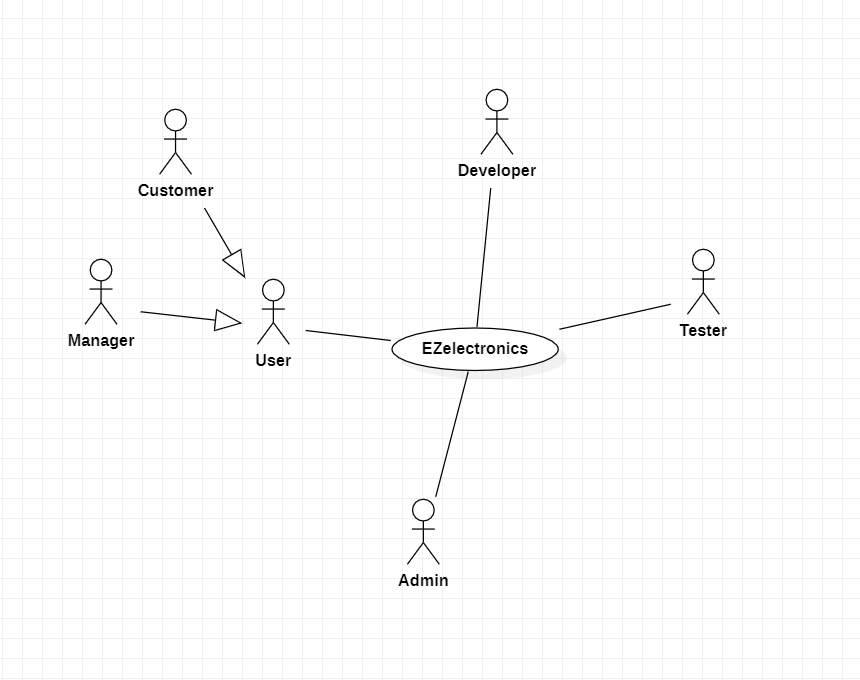
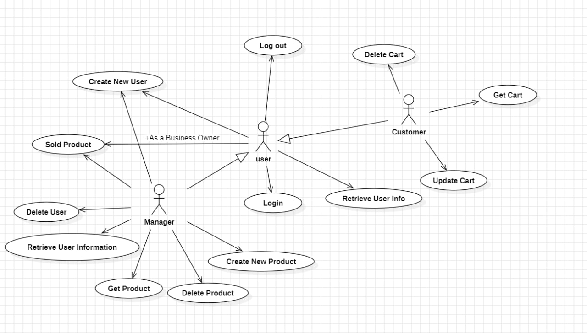
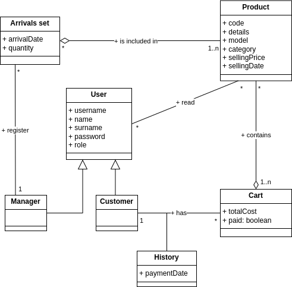
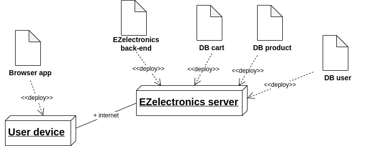

# Requirements Document - current EZElectronics

Date:

Version: V1 - description of EZElectronics in CURRENT form (as received by teachers)

| Version number | Change |
| :------------: | :----: |
|                |        |

# Contents

- [Requirements Document - current EZElectronics](#requirements-document---current-ezelectronics)
- [Contents](#contents)
- [Informal description](#informal-description)
- [Stakeholders](#stakeholders)
- [Context Diagram and interfaces](#context-diagram-and-interfaces)
  - [Context Diagram](#context-diagram)
  - [Interfaces](#interfaces)
- [Stories and personas](#stories-and-personas)
- [Functional and non functional requirements](#functional-and-non-functional-requirements)
  - [Functional Requirements](#functional-requirements)
  - [Non Functional Requirements](#non-functional-requirements)
- [Use case diagram and use cases](#use-case-diagram-and-use-cases)
  - [Use case diagram](#use-case-diagram)
- [Glossary](#glossary)
- [System Design](#system-design)
- [Deployment Diagram](#deployment-diagram)

# Informal description

EZElectronics (read EaSy Electronics) is a software application designed to help managers of electronics stores to manage their products and offer them to customers through a dedicated website. Managers can assess the available products, record new ones, and confirm purchases. Customers can see available products, add them to a cart and see the history of their past purchases.

# Stakeholders

| Stakeholder name | Description |
| :--------------: | :---------: |
| User             | Entity that interact with the system and has one of two role           |
| Manager          | One of the user roles, manager products and act as admin            |
| Customer         | One of the user roles, can by product and manage his cart           |
| Developer        | Develop the web application            |
| Tester           | Test the feature and the DB           |
| Business Owner   | Owner of the company and the one how commissioned the software           |

# Context Diagram and interfaces

## Context Diagram

## Interfaces

|   Actor   | Physical Interface | Logical Interface  |
| :-------  | :---------------:  | :----------------: |
| User      | PC, Smartphone     | GUI (Log in/Log out + common section)   |
| -- Manager   | PC, Smartphone     | GUI (Manage accounts and products)   |
| -- Customer  | PC, Smartphone     | GUI (Log in/Log out + Customer section)   |
| Developer | PC                 | GUI (Develop the application) |
| Tester    | PC                 | GUI (Test the application) + command line |

# Stories and personas

**1.Mark Thompson - Electronics Store Manager** \
Age: 35 \
Background: Mark has been working as a manager at an electronics store for the past 5 years. He is responsible for overseeing the store's operations, managing inventory, and ensuring customer satisfaction. \
Goals: Mark wants to streamline the process of managing products, recording new arrivals, and tracking sales to improve efficiency and profitability.

**2.Emily Rodriguez - Regular Customer**
Age: 28 \
Background: Emily is a tech enthusiast who frequently shops for electronics online. She values convenience and looks for a user-friendly shopping experience. \
Goals: Emily wants to easily browse through available products, add items to her cart, and track her purchase history for future reference. \

### User Stories

**1.As a store manager** \
I want to be able to log in to the EZElectronics application, so that I can access the management features and functionalities.
Acceptance Criteria: \
1.The login page should require a username/email and password for authentication. \
2.Successful login should redirect the user to the dashboard or main management page. \
**2.As a regular customer** \
I want to view all available products on the EZElectronics website, so that I can browse and make purchase decisions. \
Acceptance Criteria: \
1.The homepage should display a list of all available products with details such as name, price, and image. \
2.Each product should have a button or link to view more details and add it to the cart. \
**3.As a store manager** \
I want to be able to create a new product entry in the EZElectronics application, so that I can add newly arrived items to the inventory. \
Acceptance Criteria: \
1.The product creation form should include fields for name, category, price, quantity, and arrival date. \
2.Upon submission, the system should validate the input and add the new product to the database. \
**4.As a regular customer** \
I want to be able to add products to my shopping cart on the EZElectronics website, so that I can proceed to checkout and make a purchase. \
Acceptance Criteria: \
1.Each product listing should have an "Add to Cart" button. \
2.Upon clicking the button, the selected product should be added to the user's cart, and the cart icon should update to reflect the added item. \
**5.As a Store Manager** \
I want to retrieve a list of all users in the EZElectronics application, so that I can manage user accounts and permissions. \
Acceptance Criteria: \
1.The system should provide an option to view all registered users. \
2.The user list should include details such as username, email, role, and registration date. \

# Functional and non functional requirements

## Functional Requirements

|  ID       | Description                   |
| :---      | :---------                    |
|  FR1      | Authentication                |
|  -- FR1.0  | Log in                        |
|  -- FR1.1  | Log out with the logged-in user |
|  -- FR1.2  | Retrieve user information and credentials |
|  -- FR1.3  | Create user |
|  FR2      | User Management               |
|  -- FR2.0  | Retrieve users list or a user with specific attributes (username, role) |
|  -- FR2.1  | Delete a specific user by username |
|  -- FR2.2  | Delete all users from the database (for testing purposes) |
|  FR3      | Product Management            |
|  -- FR3.0  | Create a new product with valid parameters |
|  -- FR3.1  | Register the arrival of a set of products with valid parameters |
|  -- FR3.2  | Mark a product as sold after validation checks |
|  FR4      | Product Retrieval             |
|  -- FR4.0  | Retrieve all products from the database |
|  -- FR4.1  | Retrieve unsold products from the database |
|  -- FR4.2  | Retrieve sold products from the database |
|  -- FR4.3  | Retrieve a specific product by username |
|  -- FR4.4  | Retrieve products of a specific category |
|  -- FR4.5  | Retrieve products of a specific model |
|  FR5      | Cart Management                |
|  -- FR5.0  | Return the current cart of the logged-in user |
|  -- FR5.1  | Add a specific product to the cart |
|  -- FR5.2  | Remove a specific product from the cart |
|  -- FR5.3  | Delete the entire current cart for a user |
|  -- FR5.4  | Delete all existing carts from the database (for testing purposes) |
|  -- FR5.5  | Allow for payment of the cart if it's not empty |
|  -- FR5.6  | Record and provide the history of carts for a user |

## Non Functional Requirements

|   ID    | Type (efficiency, reliability, ..) | Description | Refers to |
| :-----: | :--------------------------------: | :---------: | :-------: |
|  NFR1     |Efficiency | "The system should respond to user interactions within a maximum of 2 seconds under normal operating conditions. | All FR |
| NFR2       |Usability | "The user interface should be intuitive and easy to navigate, requiring no more than 10 minutes of training for new users to perform common tasks such as adding products to the cart, viewing purchase history, search for specific product, category and creating new product" | All FR|
| NFR3    |Portability | "The system should be implemented as a web application, and has to be accessible from any modern web browser on desktop (from Windows 7, Ubuntu 16) and mobile devices (from IOS 14, Android 9), including Chrome, Firefox, Safari, and Edge." | All FR |

# Use case diagram and use cases

## Use case diagram

## Use cases

### UC1: User Login

| Actors Involved  |  User                                                                |
| :--------------: | :------------------------------------------------------------------: |
|   Precondition   | None                                                                 |
|  Post condition  | user is successfully logged in                                       |
| Nominal Scenario | sc1.1(a user is logged in)                                           |
|     Variants     |                                                                      |
|    Exceptions    | sc1.2(the user doesn't exist), sc1.3(the user insert a wrong password)|

#### Scenario 1.1 (a user is logged in)

|  Scenario 1.1   |                                                                            |
| :------------:  | :------------------------------------------------------------------------: |
|  Precondition   |                   The user is not currently logged in                      |
| Post condition  |                   The user is successfully logged in.                      |
|     Step#       |                                Description                                 |
|       1         |**User** navigates to the login page of the application                     |
|       2         |**User** enters their username/email into the designated field.             |
|       3         |**User** enters their password into the password field.                     |
|       4         |**User** clicks on the "Login" button.                                      |
|       5         |**system** verifies the provided credentials against the stored user data.  |
|       6         |**system** If the credentials are valid,grants access and logs the user into their account.|
|       7         |**system** displays a confirmation message indicating successful login.     |

#### Scenario 1.2 (the user doesn't exist)

|  Scenario 1.2   |                                                                            |
| :------------:  | :------------------------------------------------------------------------: |
|  Precondition   |                   The user is not currently logged in.                     |
| Post condition  |The user is not logged in, and an error message is displayed indicating the user doesn't exist.|
|     Step#       |                                Description                                 |
|       1         |**User** navigates to the login page of the application.                    |
|       2         |**User** enters their username/email into the designated field.             |
|       3         |**User** enters their password into the password field.                     |
|       4         |**User** clicks on the "Login" button.                                      |
|       5         |**system** verifies the provided credentials against the stored user data.  |
|       6         |**system** If the user doesn't exist in the system, displays an error message.|

#### Scenario 1.3 (incorrect password)

|  Scenario 1.3   |                                                                            |
| :------------:  | :------------------------------------------------------------------------: |
|  Precondition   |                   The user is not currently logged in.                     |
| Post condition  |The user is not logged in,and an error message is displayed indicating incorrect password.|
|     Step#       |                                Description                                 |
|       1         |**User** navigates to the login page of the application.                    |
|       2         |**User** enters their username/email into the designated field.             |
|       3         |**User** enters their password into the password field.                     |
|       4         |**User** clicks on the "Login" button.                                      |
|       5         |**system** verifies the provided credentials against the stored user data.  |
|       6         |**system** If the password is incorrect, the system displays an error message for password.|

### UC2: User Logout

| Actors Involved  |  User                                                                |
| :--------------: | :------------------------------------------------------------------: |
|   Precondition   | The user is logged in                                                |
|  Post condition  | user is successfully logged out                                      |
| Nominal Scenario | sc2.1(a user is logged out)                                          |
|     Variants     |                                                                      |
|    Exceptions    | sc2.2(a user is not logged out)                                      |

#### Scenario 2.1 (a user is logged out)

|  Scenario 2.1   |                                                                            |
| :------------:  | :------------------------------------------------------------------------: |
|  Precondition   |                   The user is currently logged in.                         |
| Post condition  |                The user is successfully logged out.                        |
|     Step#       |                                Description                                 |
|       1         |**User** navigates to the logout functionality within the application.      |
|       2         |**User** clicks on the "Logout" button or selects the option to logout.     |
|       3         |**system** confirms the user's intention to logoutand proceeds with the logout process.|
|       4         |**system** terminates the user's session,clearing any active session data.  |
|       5         |**system** redirects the user to the homepage or a designated logout confirmation page.|
|       6         |**system** displays a confirmation message indicating successful logout     |

#### Scenario 2.2 (a user is not logged out)

|  Scenario 2.2   |                                                                            |
| :------------:  | :------------------------------------------------------------------------: |
|  Precondition   |        The user is currently logged in.                                    |
| Post condition  |        The user remains logged in,and an error message is displayed indicating logout failure.|
|     Step#       |                                Description                                 |
|       1         |**User** attempts to logout from the application                            |
|       2         |**User** clicks on the "Logout" button or selects the option to logout.     |
|       3         |**system** encounters an unexpected error or failure during the logout process.|
|       4         |**system** displays an error message indicating the inability to logout at this time.|

### UC3: Retrieve User Information

| Actors Involved  |  User                                                                |
| :--------------: | :------------------------------------------------------------------: |
|   Precondition   | The user is logged in                                                |
|  Post condition  | User information is successfully retrieved                           |
| Nominal Scenario | sc3.1(get the user information), sc3.2(get the list of all users)    |
|     Variants     | sc3.3(get users by roles), sc3.4(get user by username)               |
|    Exceptions    | sc3.5(doesn't get the user information), sc3.6(the user doesn't exist), sc3.7(the are no user in DB)|

#### Scenario 3.1 (get the user information)

|  Scenario 3.1   |                                                                            |
| :------------:  | :------------------------------------------------------------------------: |
|  Precondition   |        The user is currently logged in.                                    |
| Post condition  |        User information is successfully retrieved.                         |
|     Step#       |                                Description                                 |
|       1         |**User** accesses the profile or account settings page within the application.|
|       2         |**system** retrieves the user's information from the database based on their logged-in session.|
|       3         |**system** displays the retrieved user information, such as name, email, and profile picture.|
|       4         |**User** can view and possibly edit their information as allowed by the application's features.|

#### Scenario 3.2 (get the list of all users)

|  Scenario 3.2   |                                                                            |
| :------------:  | :------------------------------------------------------------------------: |
|  Precondition   |        The user is currently logged in.                                    |
| Post condition  |        The list of all users is successfully retrieved                     |
|     Step#       |                                Description                                 |
|       1         |**User** accesses the administrative section or user management page within the application.|
|       2         |**system** provides an option to retrieve the list of all users.            |
|       3         |**User** triggers the action to retrieve the list of users by clicking on a corresponding button.|
|       4         |**system** retrieves the list of all users from the database.               |
|       5         |**system** displays the list of users, including their names, usernames, and other details.|

#### Scenario 3.3 (get users by roles)

|  Scenario 3.3   |                                                                            |
| :------------:  | :------------------------------------------------------------------------: |
|  Precondition   |        The user is currently logged in.                                    |
| Post condition  |       The list of users with specific roles is successfully retrieved.     |
|     Step#       |                                Description                                 |
|       1         |**User**accesses the administrative section or user management page within the application.|
|       2         |**system** provides an option to retrieve  users by their roles.            |
|       3         |**User** selects the desired role(s) from a list or input field.            |
|       4         |**User** triggers the action to retrieve users by roles by clicking on a corresponding button.|
|       5         |**system** retrieves the list of users who have the selected roles from the database.|
|       6         |**system** displays the list of users with the specified roles, including their details.|

#### Scenario 3.4 (get user by username)

|  Scenario 3.4   |                                                                            |
| :------------:  | :------------------------------------------------------------------------: |
|  Precondition   |        The user is currently logged in.                                    |
| Post condition  |       The user with the specified username is successfully retrieved.      |
|     Step#       |                                Description                                 |
|       1         |**User** accesses the search or user lookup functionality within the application.|
|       2         |**User** enters the username of the user they want to retrieve into the search field.|
|       3         |**User** triggers the search by clicking on a search button or pressing Enter.|
|       4         |**system** retrieves the user with the specified username from the database.|
|       5         |**system** displays the user's information, including their name, email, and other details.|

#### Scenario 3.5 (doesn't get the user information)

|  Scenario 3.5   |                                                                            |
| :------------:  | :------------------------------------------------------------------------: |
|  Precondition   |        The user is currently logged in.                                    |
| Post condition  | The user information is not retrieved, and an error message is displayed.  |
|     Step#       |                                Description                                 |
|       1         |**User** attempts to retrieve their information,such as accessing the profile page.|
|       2         |**system** encounters an error or failure during the retrieval process.     |
|       3         |**system** displays an error message indicating the inability to retrieve the user information.|

#### Scenario 3.6 (the user doesn't exist)

|  Scenario 3.6   |                                                                            |
| :------------:  | :------------------------------------------------------------------------: |
|  Precondition   |        The user is currently logged in.                                    |
| Post condition  |       The user does not exist, and an error message is displayed.          |
|     Step#       |                                Description                                 |
|       1         |**User** attempts to retrieve information about a specific user.            |
|       2         |**User** provides the username or identifier of the user they want to retrieve.|
|       3         |**system** searches for the specified user in the database.                 |
|       4         |**system** If the user does not exist,displays an error messageindicating the user's absence.|

#### Scenario 3.7 (the are no user in DB)

|  Scenario 3.7   |                                                                            |
| :------------:  | :------------------------------------------------------------------------: |
|  Precondition   |        The user is currently logged in.                                    |
| Post condition  |  No users are found in the database, and an error message is displayed.    |
|     Step#       |                                Description                                 |
|       1         |**User** attempts to retrieve a list of users or specific user information. |
|       2         |**system** queries the database to fetch the requested user data.           |
|       3         |**system** If there are no users in the database, displays an error message.|

### UC4: Create New User

| Actors Involved  |  User                                                                |
| :--------------: | :------------------------------------------------------------------: |
|   Precondition   | none or the user is a manger                                         |
|  Post condition  | New user is created successfully                                     |
| Nominal Scenario | sc4.1(create a new customer account), sc4.2(create a new manager account)|
|     Variants     |                                                                      |
|    Exceptions    | sc4.3(the new user is not created), sc4.4(the user already exists ), sc4.5(no permission to create a manager)|

#### Scenario 4.1 (create a new customer account)

| Scenario 4.1    |                                                                            |
| :------------:  | :------------------------------------------------------------------------: |
|  Precondition   |        The user is authorized to create new customer accounts or has appropriate permissions.|
| Post condition  |        A new customer account is successfully created.                     |
|     Step#       |                                Description                                 |
|       1         |**User** navigates to the user creation page or account registration section within the application.|
|       2         |**User** fills out the required information for the new customer account, such as name, email, etc.|
|       3         |**User** submits the filled-out form or clicks on a "Create Account" button.|
|       4         |**system** verifies the provided information and checks for any existing accounts with the same details.|
|       5         |**system**If the provided information is valid and unique, creates a new customer account.|
|       6         |**system** displays a confirmation message indicating the successful creation of the new account.|

#### Scenario 4.2 (create a new manager account)

|  Scenario 4.2   |                                                                            |
| :------------:  | :------------------------------------------------------------------------: |
|  Precondition   | The user is authorized to create new manager accounts or has appropriate permissions.|
| Post condition  | A new manager account is successfully created.                             |
|     Step#       |                                Description                                 |
|       1         |**User** accesses the administrative section or user management page within the application.|
|       2         |**User** selects the option to create a new manager account.                |
|       3         |**User** fills out the required information for the new manager account,such as name, email, etc.|
|       4         |**User** submits the filled-out form or clicks on a "Create Account" button |
|       5         |**system** verifies the provided information and checks for any existing accounts with the same details.|
|       6         |**system** If the provided information is valid and unique, the system creates a new manager account.|
|       7         |**system** displays a confirmation message indicating the successful creation of the new manager account.|

#### Scenario 4.3 (the new user is not created)

|  Scenario 4.3   |                                                                            |
| :------------:  | :------------------------------------------------------------------------: |
|  Precondition   | The user is authorized to create new accounts.                             |
| Post condition  | The new user is not created, and an error message is displayed.            |
|     Step#       |                                Description                                 |
|       1         |**User** attempts to create a new user account.                             |
|       2         |**User** fills out the required information for the new manager account,such as name, email, etc.|
|       3         |**User** submits the filled-out form or clicks on a "Create Account" button.|
|       4         |**system** encounters an error or failure during the account creation process.|
|       5         |**system** displays an error message indicating the inability to create the new user account.|

#### Scenario 4.4 (the user already exists)

|  Scenario 4.4   |                                                                            |
| :------------:  | :------------------------------------------------------------------------: |
|  Precondition   | The user is authorized to create new accounts.                             |
| Post condition  | The new user is not created, and an error message is displayed indicating the user already exists.|
|     Step#       |                                Description                                 |
|       1         |**User** attempts to create a new user account.                                 |
|       2         |**User** fills out the required information for the new manager account, such as name, email, etc.|
|       3         |**User** submits the filled-out form or clicks on a "Create Account" button |
|       4         |**system** checks for any existing accounts with the same details as the new account.|
|       5         |**system** If an account with identical details already exists,displays an error message.|

#### Scenario 4.5 (no permission to create a manager)

|  Scenario 4.5   |                                                                            |
| :------------:  | :------------------------------------------------------------------------: |
|  Precondition   | The user is authorized to create new manager accounts.                     |
| Post condition  | The new manager account is not created,and an error message is displayed indicating insufficient permissions.|
|     Step#       |                                Description                                 |
|       1         |**User** attempts to create a new manager account.                          |
|       2         |**User** fills out the required information for the new manager account,such as name, email, etc.|
|       3         |**User** submits the filled-out form or clicks on a "Create Account" button |
|       4         |**system** verifies the user's permissions to create manager accounts.      |
|       5         |**system** If the user does not have sufficient permissions,the system displays an error message.|

### UC5: Delete user

| Actors Involved  | User                                                              |
| :--------------: | :------------------------------------------------------------------: |
|   Precondition   | User is logged in                                                    |
|  Post condition  | The specified user/users no longer exists                            |
| Nominal Scenario | sc5.1(specified user is deleted)                                     |
|     Variants     | sc5.2(all users are deleted)                                         |
|    Exceptions    | sc5.3(specified user doesn't exist), sc5.4(specified user can't be deleted)|

#### Scenario 5.1 (specified user is deleted)

|  Scenario 5.1  |                                                                            |
| :------------: | :------------------------------------------------------------------------: |
|  Precondition  | User has an account, user is logged in                                     |
| Post condition | The specified user is deleted                                              |
|     Step#      |                                Description                                 |
|       1        | **User** asks to delete a user by providing the _username_                 |
|       2        | **System** check that the user with _username_ exists                      |
|       3        | **System** check for permissions to delete                                 |
|       4        | **System** delete the specified user                                       |

#### Scenario 5.2 (all users are deleted)

|  Scenario 5.2  |                                                                            |
| :------------: | :------------------------------------------------------------------------: |
|  Precondition  | User has an account, user is logged in, user is a manager and it's a test environment |
| Post condition | All users in the DB are deleted                                            |
|     Step#      |                                Description                                 |
|       1        | **User** asks to delete all users from the DB                              |
|       2        | **System** check that there are users in the DB                            |
|       3        | **System** check that it's a test environment                              |
|       4        | **System** delete all users from the DB                                    |

#### Scenario 5.3 (specified user doesn't exist)

|  Scenario 5.3  |                                                                            |
| :------------: | :------------------------------------------------------------------------: |
|  Precondition  | User has an account, user is logged in                                     |
| Post condition | The specified user is NOT deleted                                          |
|     Step#      |                                Description                                 |
|       1        | **User** asks to delete a user by providing the _username_                 |
|       2        | **System** check that the user with _username_ exists                      |
|       3        | **System** No match found                                                  |
|       4        | **System** return a 404 error to the user                                  |

#### Scenario 5.4 (specified user can't be deleted)

|  Scenario 5.4  |                                                                            |
| :------------: | :------------------------------------------------------------------------: |
|  Precondition  | User has an account, user is logged in                                     |
| Post condition | The specified user is deleted                                              |
|     Step#      |                                Description                                 |
|       1        | **User** asks to delete a user by providing the _username_                 |
|       2        | **System** check that the user with _username_ exists                      |
|       3        | **System** check for permissions to delete                                 |
|       4        | **System** permission denied                                               |
|       5        | **System** return a 404 error to the user                                       |

### UC6: Create new product

| Actors Involved  | Manager                                                              |
| :--------------: | :------------------------------------------------------------------: |
|   Precondition   | User is logged in, user has the role of Manager                      |
|  Post condition  | A new product is created                                             |
| Nominal Scenario | sc6.1(new product is created)                                        |
|     Variants     | sc6.2(a new set of products is registered)                            |
|    Exceptions    | sc6.3(product already exists), sc6.4(arrival date is after current date)|

#### Scenario 6.1 (new product is created)

|  Scenario 6.1  |                                                                            |
| :------------: | :------------------------------------------------------------------------: |
|  Precondition  | User has an account, user is logged in, user is a manager                  |
| Post condition | The new product it's added                                                 |
|     Step#      |                                Description                                 |
|       1        | **User** insert all the product parameters                                 |
|       2        | **User** send the requst with the parameters for the new product           |
|       3        | **System** check that the _code_ doesn't represent another product         |
|       4        | **System** check that the _arrivalDate_ isn't after the current date       |
|       5        | **System** add the new product to the DB and return its _code_             |

#### Scenario 6.2 (a new set of products is registered)

|  Scenario 6.2  |                                                                            |
| :------------: | :------------------------------------------------------------------------: |
|  Precondition  | User has an account, user is logged in, user is a manager                  |
| Post condition | The new set is registered                                                  |
|     Step#      |                                Description                                 |
|       1        | **User** insert the arrival set parameters                                 |
|       2        | **User** send the requst with the parameters for the new arrival set       |
|       3        | **System** check that the _model_ exists                                   |
|       4        | **System** check that the _arrivalDate_ isn't after the current date       |
|       5        | **System** add the new arrival set to the DB                               |

#### Scenario 6.3 (product already exists)

|  Scenario 6.3  |                                                                            |
| :------------: | :------------------------------------------------------------------------: |
|  Precondition  | User has an account, user is logged in, user is a manager                  |
| Post condition | The new product it's NOT added                                             |
|     Step#      |                                Description                                 |
|       1        | **User** insert all the product parameters                                 |
|       2        | **User** send the requst with the parameters for the new product           |
|       3        | **System** check that the _code_ doesn't represent another product         |
|       4        | **System** return a 409 error to the user                                  |

#### Scenario 6.4 (arrival date is after current date)

|  Scenario 6.4  |                                                                            |
| :------------: | :------------------------------------------------------------------------: |
|  Precondition  | User has an account, user is logged in, user is a manager                  |
| Post condition | The new product or arrival set it's NOT added                              |
|     Step#      |                                Description                                 |
|       1        | **User** insert all the product or arrival set parameters                  |
|       2        | **User** send the requst with the parameters                               |
|       3        | **System** check that the _code_ doesn't represent another product         |
|       4        | **System** check that the _arrivalDate_ isn't after the current date       |
|       5        | **System** return an error to the user                                     |

### UC7: Sold product

| Actors Involved  | User                                                                 |
| :--------------: | :------------------------------------------------------------------: |
|   Precondition   | User is logged in, user has the role of Manager                      |
|  Post condition  | The product is marked as sold                                        |
| Nominal Scenario | sc7.1(mark as sold)                                                  |
|     Variants     |                                                                      |
|    Exceptions    | sc7.2(product doesn't exist), sc7.3(product already sold), sc7.4(sellingDate is before arrivalDate), sc7.5(sellingDate is after current date) |

#### Scenario 7.1 (mark as sold)

|  Scenario  7.1 |                                                                            |
| :------------: | :------------------------------------------------------------------------: |
|  Precondition  | User is logged in, user has the role of Manager                               |
| Post condition | The product is marked as sold                                       |
|     Step#      |                                Description                                 |
|       1        | **User** user asks to mark the product as sold                             |
|       2        | **System** check that the _productId_ represent an existing product        |
|       3        | **System** check if the _productId_ represent a product that isn't sold    |
|       4        | **System** Match is found                                                  |
|       5        | **System** Mark the product as sold                                        |

#### Scenario 7.2 (product doesn't exist)

|  Scenario  7.2 |                                                                            |
| :------------: | :------------------------------------------------------------------------: |
|  Precondition  | User is logged in, user has the role of Manager                               |
| Post condition | The product is not marked as sold                                      |
|     Step#      |                                Description                                 |
|       1        | **User** user asks to mark the product as sold                             |
|       2        | **System** check that the _productId_ represent an existing product        |
|       3        | **System** No product is found   |
|       4        | **System** return a 404 error to user|

#### Scenario 7.3 (product already sold)

|  Scenario  7.3 |                                                                            |
| :------------: | :------------------------------------------------------------------------: |
|  Precondition  | User is logged in, user has the role of Manager                            |
| Post condition | The product is not marked as sold                                          |
|     Step#      |                                Description                                 |
|       1        | **User** user asks to mark the product as sold                             |
|       2        | **System** check that the _productId_ represent an existing product        |
|       3        | **System** check if the _productId_ represent a product that isn't sold    |
|       4        | **System** No product is found   |
|       5        | **System** return a 409 error to user                              |

#### Scenario 7.4  (sellingDate is before arrival Date)

|  Scenario  7.4 |                                                                            |
| :------------: | :------------------------------------------------------------------------: |
|  Precondition  | User is logged in, user has the role of Manager                            |
| Post condition | The product is not marked as sold                                          |
|     Step#      |                                Description                                 |
|       1        | **User** user asks to mark the product as sold                             |
|       2        | **System** check that the _productId_ represent an existing product        |
|       3        | **System** check if the _productId_ represent a product that isn't sold    |
|       4        | **System** check if the sellingdate is compatible with the arrivaldate     |
|       5        | **System** The selling date is before arrivalDate!                              |
|       6        | **System** return a 404 error to user                              |

#### Scenario 7.5  (sellingDate is after current Date)

|  Scenario  7.5 |                                                                            |
| :------------: | :------------------------------------------------------------------------: |
|  Precondition  | User is logged in, user has the role of Manager                            |
| Post condition | The product is not marked as sold                                          |
|     Step#      |                                Description                                 |
|       1        | **User** user asks to mark the product as sold                             |
|       2        | **System** check that the _productId_ represent an existing product        |
|       3        | **System** check if the _productId_ represent a product that isn't sold    |
|       4        | **System** check if the sellingdate is compatible with the arrivaldate     |
|       5        | **System** The selling date is after current date!                              |
|       6        | **System** return a 404 error to user                           |

### UC8: Get products

| Actors Involved  | User                                                                 |
| :--------------: | :------------------------------------------------------------------: |
|   Precondition   | User is logged in                                                    |
|  Post condition  | An array of Product objects or a product is retrived                 |
| Nominal Scenario | sc8.1(get all products), sc8.2(get the requested product)            |
|     Variants     | sc8.3(get only sold/unsold products), sc8.4(get product by category), sc8.5(get product by model)|
|    Exceptions    | sc8.6(no products in the database), sc8.7(product doesn't exist)     |

#### Scenario 8.1  (get all products)

|  Scenario  8.1 |                                                                            |
| :------------: | :------------------------------------------------------------------------: |
|  Precondition  | User is logged in                                   |
| Post condition | An array of Product objects or a product is retrived                                         |
|     Step#      |                                Description                                 |
|       1        | **User** user asks to get all products                             |
|       2        | **System** check that the products are present in the database        |
|       3        | **System** returns all the products in an array        |

#### Scenario 8.2  (get the requested product)

|  Scenario  8.2 |                                                                            |
| :------------: | :------------------------------------------------------------------------: |
|  Precondition  | User is logged in                                   |
| Post condition | An array of Product objects or a product is retrived                                         |
|     Step#      |                                Description                                 |
|       1        | **User** user asks to get a specific product                             |
|       2        | **System** check that the products are present in the database        |
|       3        | **System** return an array containing one product|

#### Scenario 8.3  (get only sold/unsold products)

|  Scenario  8.3 |                                                                            |
| :------------: | :------------------------------------------------------------------------: |
|  Precondition  | User is logged in                                   |
| Post condition | An array of Product objects or a product is retrived                                         |
|     Step#      |                                Description                                 |
|       1        | **User** user asks to get a eihter sold or unsold products                             |
|       2        | **System** check that the products are present in the database        |
|       3        | **System** return an array containing sold or unsold products|

#### Scenario 8.4  (get product by category)

|  Scenario  8.4 |                                                                            |
| :------------: | :------------------------------------------------------------------------: |
|  Precondition  | User is logged in                                   |
| Post condition | An array of Product objects or a product is retrived                                         |
|     Step#      |                                Description                                 |
|       1        | **User** user asks to get a specific category of products                             |
|       2        | **System** check that the products are present in the database        |
|       3        | **System** return an array containing the required category of products|

#### Scenario 8.5  (get product by model)

|  Scenario  8.5 |                                                                            |
| :------------: | :------------------------------------------------------------------------: |
|  Precondition  | User is logged in                                   |
| Post condition | An array of Products objects or a product is retrived                                         |
|     Step#      |                                Description                                 |
|       1        | **User** user asks to get a specific model of products                             |
|       2        | **System** check that the products are present in the database        |
|       3        | **System** return an array containing the required model of products|

#### Scenario 8.6(no products in the database)

|  Scenario  8.6 |                                                                            |
| :------------: | :------------------------------------------------------------------------: |
|  Precondition  | User is logged in                            |
| Post condition | NO products retrieved                                          |
|     Step#      |                                Description                                 |
|       1        | **User** user asks to get specific products or all products                         |
|       2        | **System** check that the products are present in the database        |
|       3        | **System** No such match with the required!                              |
|       4        | **System** return a 404 error to user                           |

#### Scenario 8.7(product doesn't exist)

|  Scenario  8.6 |                                                                            |
| :------------: | :------------------------------------------------------------------------: |
|  Precondition  | User is logged in                            |
| Post condition | NO product retrieved                                          |
|     Step#      |                                Description                                 |
|       1        | **User** user asks to get specific product                         |
|       2        | **System** check that the product is present in the database        |
|       3        | **System** No such match with the required!                              |
|       4        | **System** return a 404 error to user                           |

### UC9: Delete products

| Actors Involved  | Manager                                                              |
| :--------------: | :------------------------------------------------------------------: |
|   Precondition   | User is logged in, user has the role of Manager                      |
|  Post condition  | All products or a specified product are deleted                      |
| Nominal Scenario | sc9.1(Delete all the products), sc9.2(product is present and deleted )|
|     Variants     |                                                                      |
|    Exceptions    | sc9.3(product does not exist)                                        |

#### Scenario 9.1(Delete all the products)

|  Scenario  9.1 |                                                                            |
| :------------: | :------------------------------------------------------------------------: |
|  Precondition  | User is logged in, user has the role of Manager                            |
| Post condition | All products are deleted                                          |
|     Step#      |                                Description                                 |
|       1        | **User** user asks to delete all products                                  |
|       2        | **System** Empty the database from all the products                         |

#### Scenario 9.2(product is present and deleted)

|  Scenario  9.2 |                                                                            |
| :------------: | :------------------------------------------------------------------------: |
|  Precondition  | User is logged in, user has the role of Manager                            |
| Post condition | product is deleted                                          |
|     Step#      |                                Description                                 |
|       1        | **User** user asks to delete specific product                                  |
|       2        | **System** check that the product is present in the database        |
|       3        | **System** Delete the product from the database                      |

#### Scenario 9.3(product does not exist)

|  Scenario  9.3 |                                                                            |
| :------------: | :------------------------------------------------------------------------: |
|  Precondition  | User is logged in, user has the role of Manager                            |
| Post condition | product is not deleted                                          |
|     Step#      |                                Description                                 |
|       1        | **User** user asks to delete specific product                                  |
|       2        | **System** check that the product is present in the database        |
|       3        | **System** No match is found                    |
|       4        | **System** return a 404 error                   |

### UC10: Get cart

| Actors Involved  | Customer                                                             |
| :--------------: | :------------------------------------------------------------------: |
|   Precondition   | User is logged in, user has the role of Customer                     |
|  Post condition  | Get the cart of the user                                             |
| Nominal Scenario | sc10.1(get current cart)                                             |
|     Variants     | sc10.2(get carts history)                                            |
|    Exceptions    | sc10.3(couldn't get cart)                                            |

#### Scenario 10.1 (get current cart)

|  Scenario 10.1 |                                                                            |
| :------------: | :------------------------------------------------------------------------: |
|  Precondition  | User has an account, user is logged in, user is a customer                 |
| Post condition | Get the current cart of the user                                           |
|     Step#      |                                Description                                 |
|       1        | **User** ask for its current cart                                          |
|       2        | **System** check that the logged in user has a cart                        |
|       3        | **System** return the current cart to the user                             |

#### Scenario 10.2 (get carts history)

|  Scenario 10.2 |                                                                            |
| :------------: | :------------------------------------------------------------------------: |
|  Precondition  | User has an account, user is logged in, user is a customer                 |
| Post condition | Get list of the previous cart of the user                                  |
|     Step#      |                                Description                                 |
|       1        | **User** ask for its carts history                                         |
|       2        | **System** check that the logged in user has carts in his history          |
|       3        | **System** return the list of carts history to the user                    |

#### Scenario 10.3 (couldn't get cart)

|  Scenario 10.3 |                                                                            |
| :------------: | :------------------------------------------------------------------------: |
|  Precondition  | User has an account, user is logged in, user is a customer                 |
| Post condition | Can NOT get the current cart or carts history of the user                  |
|     Step#      |                                Description                                 |
|       1        | **User** ask for its current cart or carts history                         |
|       2        | **System** check that the logged in user has a cart                        |
|       3        | **System** return an error to the user                                     |

### UC11: Update cart

| Actors Involved  | Customer                                                             |
| :--------------: | :------------------------------------------------------------------: |
|   Precondition   | User is logged in, user has the role of Customer                     |
|  Post condition  | The cart is updated                                                  |
| Nominal Scenario | sc11.1(add product to current cart)                                  |
|     Variants     | sc11.2(mark cart as payed)                                           |
|    Exceptions    | sc11.3(product doesn't exists), sc11.4(product already in a cart), sc11.5(product already sold), sc11.6(cart is empty)                           |

#### Scenario 11.1 (add product to current cart)

|  Scenario 11.1 |                                                                            |
| :------------: | :------------------------------------------------------------------------: |
|  Precondition  | User has an account, user is logged in, user is a customer, user has a cart|
| Post condition | A product is added to the user cart                                        |
|     Step#      |                                Description                                 |
|       1        | **User** ask to add a product to its cart                                  |
|       2        | **System** check that the _productId_ represent an existing product        |
|       3        | **System** check if the _productId_ represent a product already in the cart|
|       4        | **System** check if the _productId_ represent a product that isn't sold    |
|       5        | **System** add the product to the user current cart                        |

#### Scenario 11.2 (mark cart as payed)

|  Scenario 11.2 |                                                                            |
| :------------: | :------------------------------------------------------------------------: |
|  Precondition  | User has an account, user is logged in, user is a customer, user has a cart|
| Post condition | The cart is marked as payed                                                |
|     Step#      |                                Description                                 |
|       1        | **User** ask to mark the current cart as payed                             |
|       2        | **System** check that the cart isn't empty                                 |
|       3        | **System** check that the cart isn't already payed                         |
|       4        | **System** mark the cart as payed                                          |

#### Scenario 11.3 (product doesn't exists)

|  Scenario 11.3 |                                                                            |
| :------------: | :------------------------------------------------------------------------: |
|  Precondition  | User has an account, user is logged in, user is a customer, user has a cart|
| Post condition | The product is NOT added to the user cart                                  |
|     Step#      |                                Description                                 |
|       1        | **User** ask to add a product to its cart                                  |
|       2        | **System** check that the _productId_ represent an existing product        |
|       3        | **System** return a 404 error to the user                                  |

#### Scenario 11.4 (product already in a cart)

|  Scenario 11.4 |                                                                            |
| :------------: | :------------------------------------------------------------------------: |
|  Precondition  | User has an account, user is logged in, user is a customer, user has a cart|
| Post condition | The product is NOT added to the user cart                                  |
|     Step#      |                                Description                                 |
|       1        | **User** ask to add a product to its cart                                  |
|       2        | **System** check that the _productId_ represent an existing product        |
|       3        | **System** check if the _productId_ represent a product already in the cart|
|       4        | **System** return a 409 error to the user                                  |

#### Scenario 11.5 (product already sold)

|  Scenario 11.5 |                                                                            |
| :------------: | :------------------------------------------------------------------------: |
|  Precondition  | User has an account, user is logged in, user is a customer, user has a cart|
| Post condition | The product is NOT added to the user cart                                  |
|     Step#      |                                Description                                 |
|       1        | **User** ask to add a product to its cart                                  |
|       2        | **System** check that the _productId_ represent an existing product        |
|       3        | **System** check if the _productId_ represent a product already in the cart|
|       4        | **System** check if the _productId_ represent a product that isn't sold    |
|       5        | **System** return a 409 error to the user                                  |

#### Scenario 11.6 (cart is empty)

|  Scenario 11.6 |                                                                            |
| :------------: | :------------------------------------------------------------------------: |
|  Precondition  | User has an account, user is logged in, user is a customer, user has a cart|
| Post condition | The cart is NOT marked as payed                                            |
|     Step#      |                                Description                                 |
|       1        | **User** ask to mark the current cart as payed                             |
|       2        | **System** check that the cart isn't empty                                 |
|       3        | **System** return a 404 error to the user                                  |

### UC12: Delete cart

| Actors Involved  | Customer                                                             |
| :--------------: | :------------------------------------------------------------------: |
|   Precondition   | User is logged in                                                    |
|  Post condition  | Delete cart or product in a cart                                     |
| Nominal Scenario | sc12.1(delete a product in current user cart)                        |
|     Variants     | sc12.2(delete current user cart), sc12.3(delete all carts in DB)     |
|    Exceptions    | sc12.4(product not in the cart), sc12.5(product already sold), sc12.6(product doesn't exists)|

#### Scenario 12.1 (delete a product in current user cart)

|  Scenario 12.1 |                                                                            |
| :------------: | :------------------------------------------------------------------------: |
|  Precondition  | User has an account, user is logged in, user is a customer, user has a cart|
| Post condition | The product is deleted from the user cart                                 |
|     Step#      |                                Description                                 |
|       1        | **User** ask to delete a product from its cart                            |
|       2        | **System** check that the _productId_ represent an existing product        |
|       3        | **System** check if the _productId_ represent a product in the cart       |
|       4        | **System** delete the product from the user cart                          |

#### Scenario 12.2 (delete current user cart)

|  Scenario 12.2 |                                                                            |
| :------------: | :------------------------------------------------------------------------: |
|  Precondition  | User has an account, user is logged in, user is a customer, user has a cart|
| Post condition | The current cart is deleted                                                |
|     Step#      |                                Description                                 |
|       1        | **User** ask to delete its current cart                                    |
|       2        | **System** delete the current cart                                         |

#### Scenario 12.3 (delete all carts in DB)

|  Scenario 12.3 |                                                                            |
| :------------: | :------------------------------------------------------------------------: |
|  Precondition  | User has an account, user is logged in, user is a manager, it's a test environment|
| Post condition | All carts in the DB are deleted                                           |
|     Step#      |                                Description                                 |
|       1        | **User** ask to delete all carts in the DB                                 |
|       2        | **System** delete all carts in the DB                                      |

#### Scenario 12.4 (product not in the cart)

|  Scenario 12.4 |                                                                            |
| :------------: | :------------------------------------------------------------------------: |
|  Precondition  | User has an account, user is logged in, user is a customer, user has a cart|
| Post condition | The product is NOT deleted from the user cart                              |
|     Step#      |                                Description                                 |
|       1        | **User** ask to delete a product from its cart                            |
|       2        | **System** check that the _productId_ represent an existing product        |
|       3        | **System** check if the _productId_ represent a product in the cart       |
|       4        | **System** return a 404 error to the user                                  |

#### Scenario 12.5 (product already sold)

|  Scenario 12.5 |                                                                            |
| :------------: | :------------------------------------------------------------------------: |
|  Precondition  | User has an account, user is logged in, user is a customer, user has a cart|
| Post condition | The product is NOT deleted from the user cart                              |
|     Step#      |                                Description                                 |
|       1        | **User** ask to delete a product from its cart                             |
|       2        | **System** check that the _productId_ represent an existing product        |
|       3        | **System** check if the _productId_ represent a product in the cart        |
|       4        | **System** check if the _productId_ represent a product that isn't sold    |
|       5        | **System** return a 409 error to the user                                  |

#### Scenario 12.6 (product doesn't exists)

|  Scenario 12.6 |                                                                            |
| :------------: | :------------------------------------------------------------------------: |
|  Precondition  | User has an account, user is logged in, user is a customer, user has a cart|
| Post condition | The product is NOT deleted from the user cart                              |
|     Step#      |                                Description                                 |
|       1        | **User** ask to delete a product from its cart                             |
|       2        | **System** check that the _productId_ represent an existing product        |
|       3        | **System** return a 404 error to the user                                  |

# Glossary

# System Design

\<describe here system design>

\<must be consistent with Context diagram>

# Deployment Diagram

