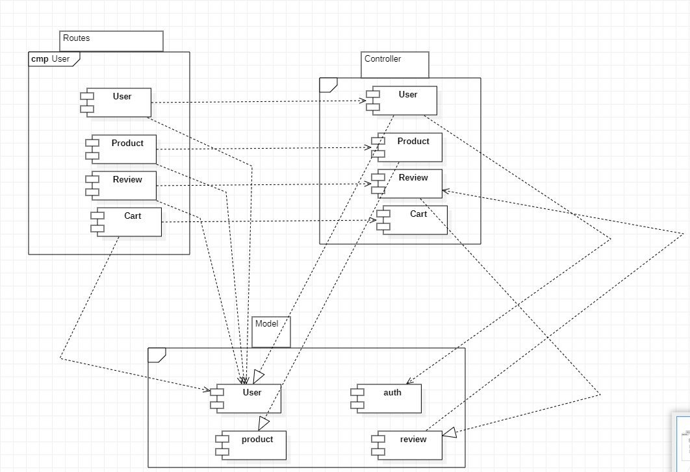
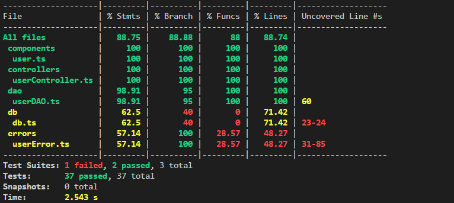

# Test Report

# Contents

- [Dependency graph](#dependency-graph)

- [Integration approach](#integration-approach)

- [Tests](#tests)

- [Coverage](#Coverage)

# Dependency graph 

# Integration approach

   
 
The integration sequence that was adopted follows a bottom-up approach starting from unit testing ending with API testing.  
The development process started by creating the individual functions. These functions were then isolately tested using unit tests. Mocks objects were used to simulate dependencies ensuring that each mocked functions behaved correctly. 
We then integrated functions and modules ensuring that the interaction between the functions and their dependencies worked as expected.  
API testing was conducted handling routes incoming requests and confirming the expected response. Summarizing here the step followed: 
 
1. step: unit testing 
     - step 1.1: util.js 
    - step 1.2: users.js 
     - step 1.3: controller.js 
    - step 1.4: auth.js 
2.  step: API testing 
    - step 2.1: util.integration.test.js 
    - step 2.2: users.integration.test.js 
    - step 2.3: controller.integration.test.js 
    - step 2.4: auth.integration.test.js 
 
 
Although integration testing was omitted, our team effectively executed API testing and unit testing, ensuring comprehensive coverage of all dependency scenarios. Considered the complexity f the project as well as the above described considerations they minimized a chaotic "big bang" integration and facilitated the identification of errors during function development. By accurately testing each function with various inputs, including those expected to produce errors (e.g., invalid email formats), and employing mocking functions to handle different conditions, we successfully addressed potential issues. However, it is essential to acknowledge that the current organizational situation exacerbated the challenges faced, noticeably the lack of integration testing complicated the system's overall complexity and risk. Despite this setback, our rigorous API and unit testing approach significantly reduced the likelihood of critical errors and allowed for targeted issue resolution within individual components. 

# Tests

<h2>Unit test</h2>

#### Scenario: Add a product to the current cart

| Test Case | Method Tested | Type | Coverage | Status |
| --- | --- | --- | --- | --- |
| It should add a product to the current cart | CartController.addToCart | Unit | WB / statement coverage |  |
| Product successfully added to the cart | Cart, Product |  |  |
| Exception: Product not found | CartController.addToCart - Product with specified ID not found | Unit | WB / statement coverage |  |

#### Scenario: Remove a product from the current cart

| Test Case | Method Tested | Type | Coverage | Status |
| --- | --- | --- | --- | --- |
| It should remove a product from the current cart | CartController.removeProductFromCart | Unit | WB / statement coverage |  |
| Product successfully removed from the cart | Cart, Product |  |  |
| Exception: Product not found | CartController.removeProductFromCart - Product with specified ID not found | Unit | WB / statement coverage |  |

#### Scenario: Delete the current cart

| Test Case | Method Tested | Type | Coverage | Status |
| --- | --- | --- | --- | --- |
| It should delete the current cart | CartController.clearCart | Unit | WB / statement coverage |  |
| Cart successfully cleared | Cart |  |  |

#### Scenario: Delete all carts

| Test Case | Method Tested | Type | Coverage | Status |
| --- | --- | --- | --- | --- |
| It should delete all carts | CartController.deleteAllCarts | Unit | WB / statement coverage |  |
| All carts successfully deleted | Cart |  |  |

#### Scenario: See the list of all carts of all users

| Test Case | Method Tested | Type | Coverage | Status |
| --- | --- | --- | --- | --- |
| It should retrieve the list of all carts of all users | CartController.getAllCarts | Unit | WB / statement coverage |  |
| All carts of all users successfully retrieved | Cart |  |  |

#### Scenario: Show the information of the current cart

| Test Case | Method Tested | Type | Coverage | Status |
| --- | --- | --- | --- | --- |
| It should retrieve the information of the current cart | CartController.getCart | Unit | WB / statement coverage |  |
| Information of current cart successfully retrieved | Cart |  |  |

#### Scenario: Checkout the current cart

| Test Case | Method Tested | Type | Coverage | Status |
| --- | --- | --- | --- | --- |
| It should checkout the current cart | CartController.checkoutCart | Unit | WB / statement coverage |  |
| Cart successfully checked out | Cart |  |  |

#### Scenario: Show the history of the paid carts

| Test Case | Method Tested | Type | Coverage | Status |
| --- | --- | --- | --- | --- |
| It should retrieve the history of paid carts | CartController.getCustomerCarts | Unit | WB / statement coverage |  |
| History of paid carts successfully retrieved | Cart |  |  |

#### Scenario: Register a set of new products

| Test Case | Method Tested | Type | Coverage | Status |
| --- | --- | --- | --- | --- |
| Product successfully registered with valid inputs | ProductController.registerProducts | Unit | WB / statement coverage |  |
| Exception: Product already exists | ProductController.registerProducts - Product with same model already exists in database | Unit | WB / statement coverage |  |
| Exception: Arrival date is in the future | ProductController.registerProducts - Arrival date provided is in the future | Unit | WB / statement coverage |  |

#### Scenario: Update the quantity of a product

| Test Case | Method Tested | Type | Coverage | Status |
| --- | --- | --- | --- | --- |
| Product quantity successfully updated | ProductController.changeProductQuantity | Unit | WB / statement coverage |  |
| Exception: Product not found | ProductController.changeProductQuantity - Product with specified model not found | Unit | WB / statement coverage |  |
| Exception: Change date is before arrival date | ProductController.changeProductQuantity - Change date provided is before product's arrival date | Unit | WB / statement coverage |  |

#### Scenario: Sell a product

| Test Case | Method Tested | Type | Coverage | Status |
| --- | --- | --- | --- | --- |
| Product successfully sold | ProductController.sellProduct | Unit | WB / statement coverage |  |
| Exception: Product not found | ProductController.sellProduct - Product with specified model not found | Unit | WB / statement coverage |  |
| Exception: Selling date is before arrival date | ProductController.sellProduct - Selling date provided is before product's arrival date | Unit | WB / statement coverage |  |
| Exception: Product out of stock | ProductController.sellProduct - Product quantity available is less than quantity to sell | Unit | WB / statement coverage |  |

#### Scenario: Show the list of all products

| Test Case | Method Tested | Type | Coverage | Status |
| --- | --- | --- | --- | --- |
| All products retrieved successfully | ProductController.getProducts | Unit | WB / statement coverage |  |

#### Scenario: Show the list of all available products

| Test Case | Method Tested | Type | Coverage | Status |
| --- | --- | --- | --- | --- |
| All available products retrieved successfully | ProductController.getAvailableProducts | Unit | WB / statement coverage |  |

#### Scenario: Show the list of all products with the same category

| Test Case | Method Tested | Type | Coverage | Status |
| --- | --- | --- | --- | --- |
| Products with specified category retrieved successfully | ProductController.getProductsByCategory | Unit | WB / statement coverage |  |

#### Scenario: Show the list of all available products with the same category

| Test Case | Method Tested | Type | Coverage | Status |
| --- | --- | --- | --- | --- |
| Available products with specified category retrieved successfully | ProductController.getAvailableProductsByCategory | Unit | WB / statement coverage |  |

#### Scenario: Show the list of all products with the same model

| Test Case | Method Tested | Type | Coverage | Status |
| --- | --- | --- | --- | --- |
| Products with specified model retrieved successfully | ProductController.getProductsByModel | Unit | WB / statement coverage |  |

#### Scenario: Show the list of all available products with the same model

| Test Case | Method Tested | Type | Coverage | Status |
| --- | --- | --- | --- | --- |
| Available products with specified model retrieved successfully | ProductController.getAvailableProductsByModel | Unit | WB / statement coverage |  |

#### Scenario: Delete a product

| Test Case | Method Tested | Type | Coverage | Status |
| --- | --- | --- | --- | --- |
| Product successfully deleted | ProductController.deleteProduct | Unit | WB / statement coverage |  |
| Exception: Product not found | ProductController.deleteProduct - Product with specified model not found | Unit | WB / statement coverage |  |

#### Scenario: Delete all products

| Test Case | Method Tested | Type | Coverage | Status |
| --- | --- | --- | --- | --- |
| All products successfully deleted | ProductController.deleteAllProducts | Unit | WB / statement coverage |  |

#### Scenario: Create a new user

| Test Case | Method Tested | Type | Coverage | Status |
| --- | --- | --- | --- | --- |
| It should return true if user is created | UserController.createUser | Unit | WB / statement coverage |  |
| User successfully created with valid inputs | User |  |  |
| Exception: Error when creating user | UserController.createUser - Error occurred while creating user | Unit | WB / statement coverage |  |

#### Scenario: Get all users

| Test Case | Method Tested | Type | Coverage | Status |
| --- | --- | --- | --- | --- |
| It should return an array of users | UserController.getUsers | Unit | WB / statement coverage |  |
| All users retrieved successfully | User |  |  |

#### Scenario: Get users by role

| Test Case | Method Tested | Type | Coverage | Status |
| --- | --- | --- | --- | --- |
| It should return an array of users with the specified role | UserController.getUsersByRole | Unit | WB / statement coverage |  |
| Users with specified role retrieved successfully | User |  |  |

#### Scenario: Get user by username

| Test Case | Method Tested | Type | Coverage | Status |
| --- | --- | --- | --- | --- |
| It should return the requested user | UserController.getUserByUsername | Unit | WB / statement coverage |  |
| Requested user retrieved successfully | User |  |  |
| Exception: Error when getting user by username | UserController.getUserByUsername - Error occurred while retrieving user | Unit | WB / statement coverage |  |

#### Scenario: Delete a user

| Test Case | Method Tested | Type | Coverage | Status |
| --- | --- | --- | --- | --- |
| It should return true when user is deleted | UserController.deleteUser | Unit | WB / statement coverage |  |
| User successfully deleted | User |  |  |
| Exception: Error when deleting user | UserController.deleteUser - Error occurred while deleting user | Unit | WB / statement coverage |  |

#### Scenario: Delete all users

| Test Case | Method Tested | Type | Coverage | Status |
| --- | --- | --- | --- | --- |
| It should return true if all users are deleted | UserController.deleteAll | Unit | WB / statement coverage |  |
| All users successfully deleted | User |  |  |
| Exception: Error when deleting all users | UserController.deleteAll - Error occurred while deleting all users | Unit | WB / statement coverage |  |

#### Scenario: Update user information

| Test Case | Method Tested | Type | Coverage | Status |
| --- | --- | --- | --- | --- |
| It should return the updated user | UserController.updateUserInfo | Unit | WB / statement coverage |  |
| User information updated successfully | User |  |  |
| Exception: Error when updating user information | UserController.updateUserInfo - Error occurred while updating user information | Unit | WB / statement coverage |  |

#### Scenario: Add a new review

| Test Case | Method Tested | Type | Coverage | Status |
| --- | --- | --- | --- | --- |
| It should throw ProductNotFoundError | ReviewController.addReview - Product not found | Unit | WB / statement coverage | Pass |
| It should throw ExistingReviewError | ReviewController.addReview - User already reviewed product | Unit | WB / statement coverage | Pass |
| It should add a new review successfully | ReviewController.addReview - Review added | Unit | WB / statement coverage | Pass |

#### Scenario: Get product reviews

| Test Case | Method Tested | Type | Coverage | Status |
| --- | --- | --- | --- | --- |
| It should return existing reviews | ReviewController.getProductReviews - Reviews found | Unit | WB / statement coverage | Pass |
| It should return an empty array | ReviewController.getProductReviews - No reviews found | Unit | WB / statement coverage | Pass |

#### Scenario: Delete a review

| Test Case | Method Tested | Type | Coverage | Status |
| --- | --- | --- | --- | --- |
| It should throw ProductNotFoundError | ReviewController.deleteReview - Product not found | Unit | WB / statement coverage | Pass |
| It should throw NoReviewProductError | ReviewController.deleteReview - No review found | Unit | WB / statement coverage | Pass |
| It should delete the review successfully | ReviewController.deleteReview - Review deleted | Unit | WB / statement coverage | Pass |

#### Scenario: Delete all reviews of a product

| Test Case | Method Tested | Type | Coverage | Status |
| --- | --- | --- | --- | --- |
| It should throw ProductNotFoundError | ReviewController.deleteReviewsOfProduct - Product not found | Unit | WB / statement coverage | Pass |
| It should delete all reviews successfully | ReviewController.deleteReviewsOfProduct - Reviews deleted | Unit | WB / statement coverage | Pass |

# Coverage

## Coverage of FR

### CART

| Functional Requirements covered | Unit Test(s) |
| ------------------------------- | :----------- |
| FR5.1 Show the information of the current cart | <ul><li>Nominal scenario: CartController.getCart</li></ul> |
| FR5.2 Add a product to the current cart | <ul><li>Nominal scenario: CartController.addToCart</li><li>Exception: Product not found</li></ul> |
| FR5.3 Checkout the current cart | <ul><li>Nominal scenario: CartController.checkoutCart</li></ul> |
| FR5.4 Show the history of the paid carts | <ul><li>Nominal scenario: CartController.getCustomerCarts</li></ul> |
| FR5.5 Remove a product from the current cart | <ul><li>Nominal scenario: CartController.removeProductFromCart</li><li>Exception: Product not found</li></ul> |
| FR5.6 Delete the current cart | <ul><li>Nominal scenario: CartController.clearCart</li></ul> |
| FR5.7 See the list of all carts of all users | <ul><li>Nominal scenario: CartController.getAllCarts</li></ul> |
| FR5.8 Delete all carts | <ul><li>Nominal scenario: CartController.deleteAllCarts</li></ul> |

### PRODUCT

| Functional Requirements covered | Unit Test(s) |
| ------------------------------- | :----------- |
| FR3.1 Register a set of new products | <ul><li>Nominal scenario: ProductController.registerProducts</li><li>Exception: Product already exists</li><li>Exception: Arrival date is in the future</li></ul> |
| FR3.2 Update the quantity of a product | <ul><li>Nominal scenario: ProductController.changeProductQuantity</li><li>Exception: Product not found</li><li>Exception: Change date is before arrival date</li></ul> |
| FR3.3 Sell a product | <ul><li>Nominal scenario: ProductController.sellProduct</li><li>Exception: Product not found</li><li>Exception: Selling date is before arrival date</li><li>Exception: Product out of stock</li></ul> |
| FR3.4 Show the list of all products | <ul><li>Nominal scenario: ProductController.getProducts</li></ul> |
| FR3.4.1 Show the list of all available products | <ul><li>Nominal scenario: ProductController.getAvailableProducts</li></ul> |
| FR3.5 Show the list of all products with the same category | <ul><li>Nominal scenario: ProductController.getProductsByCategory</li></ul> |
| FR3.5.1 Show the list of all available products with the same category | <ul><li>Nominal scenario: ProductController.getAvailableProductsByCategory</li></ul> |
| FR3.6 Show the list of all products with the same model | <ul><li>Nominal scenario: ProductController.getProductsByModel</li></ul> |
| FR3.6.1 Show the list of all available products with the same model | <ul><li>Nominal scenario: ProductController.getAvailableProductsByModel</li></ul> |
| FR3.7 Delete a product | <ul><li>Nominal scenario: ProductController.deleteProduct</li><li>Exception: Product not found</li></ul> |
| FR3.8 Delete all products | <ul><li>Nominal scenario: ProductController.deleteAllProducts</li></ul> |
### USER
| Functional Requirements covered | Unit Test(s) |
| ------------------------------- | :----------- |
| FR3.1 Create a new user | <ul><li>Nominal scenario: UserController.createUser</li><li>Exception: Error when creating user</li></ul> |
| FR3.2 Get all users | <ul><li>Nominal scenario: UserController.getUsers</li></ul> |
| FR3.3 Get users by role | <ul><li>Nominal scenario: UserController.getUsersByRole</li></ul> |
| FR3.4 Get user by username | <ul><li>Nominal scenario: UserController.getUserByUsername</li><li>Exception: Error when getting user by username</li></ul> |
| FR3.5 Delete a user | <ul><li>Nominal scenario: UserController.deleteUser</li><li>Exception: Error when deleting user</li></ul> |
| FR3.6 Delete all users | <ul><li>Nominal scenario: UserController.deleteAll</li><li>Exception: Error when deleting all users</li></ul> |
| FR3.7 Update user information | <ul><li>Nominal scenario: UserController.updateUserInfo</li><li>Exception: Error when updating user information</li></ul> |

### REVIEW
| Functional Requirements covered | Unit Test(s) |
| ------------------------------- | :----------- |
| Add a new review | <ul><li>It should throw ProductNotFoundError: ReviewController.addReview - Product not found</li><li>It should throw ExistingReviewError: ReviewController.addReview - User already reviewed product</li><li>It should add a new review successfully: ReviewController.addReview - Review added</li></ul> |
| Get product reviews | <ul><li>It should return existing reviews: ReviewController.getProductReviews - Reviews found</li><li>It should return an empty array: ReviewController.getProductReviews - No reviews found</li></ul> |
| Delete a review | <ul><li>It should throw ProductNotFoundError: ReviewController.deleteReview - Product not found</li><li>It should throw NoReviewProductError: ReviewController.deleteReview - No review found</li><li>It should delete the review successfully: ReviewController.deleteReview - Review deleted</li></ul> |
| Delete all reviews of a product | <ul><li>It should throw ProductNotFoundError: ReviewController.deleteReviewsOfProduct - Product not found</li><li>It should delete all reviews successfully: ReviewController.deleteReviewsOfProduct - Reviews deleted</li></ul> |

                                       ****** FOR EXAMPLE OF COVERAGE****************
### User Coverage

